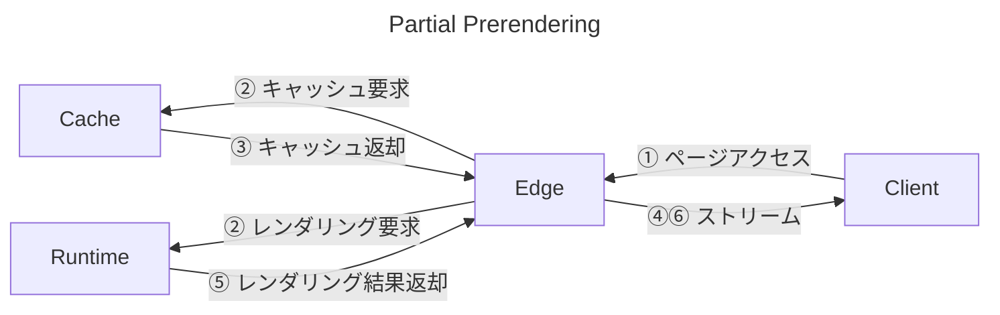
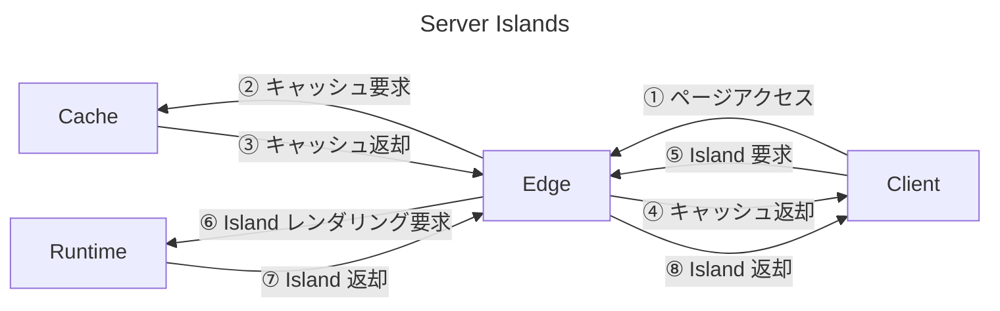

## はじめに

2024 年 12 月 3 日、[Astro 5.0](https://astro.build/blog/astro-5/) がリリースされましたが、v5 の目玉機能の一つが Server Islands です。この記事では、Next.js の Partial Prerendering などの各レンダリングモデルと比較しながら、Server Islands の概要や仕組みについて解説します。

「基本的に Server Islands は Astro 版の Partial Prerendering といえるが、動的なコンテンツの取得方法という点において決定的に異なっており、そのことの帰結として両者はパフォーマンスとポータビリティのトレードオフの関係にある」というのが最終的な結論ですが、その結論へと至るまでのあいだで、他のレンダリングモデルについても詳しく説明しています。その結果少し長めの記事となりましたが、サンプルコードや動作確認のためのアプリケーションも用意していますので、じっくり腰を据えてお付き合いいただければ幸いです。


## Partial Prerendering のおさらい

まず、[Next.js v14](https://nextjs.org/blog/next-14#partial-prerendering-preview) において導入された Partial Prerendering（以降は基本的に PPR と略します）についておさらいしましょう。ここではわかりやすさのため Next.js プロジェクトを Vercel へとデプロイした場合を前提として説明するため、最初に Vercel へのリクエストがどのように処理されるかについて述べ、議論に必要な範囲でリクエストからレンダリングに至るプロセスに関する解像度を上げておきます。その上で、

- Static Rendering
- Dynamic Rendering
- Streaming
- Partial Prerendering

という各種のレンダリング方式について、ひとつひとつ解説していきます。

なお、各レンダリング方式を実際に体験できるよう、それぞれに対応したページをもつ Next.js プロジェクトを

https://nextjs-ppr-demo.vercel.app/

にデプロイしてありますので、ブラウザの開発者ツールを開きながら各ページにアクセスし、動作を確認してみてください。対応するソースコードは以下のリポジトリに置いてあります:

https://github.com/morinokami/nextjs-ppr

### Vercel へのリクエストの全体像

Vercel 上にデプロイされた Next.js アプリケーションにブラウザなどを通じてアクセスしようとすると、最終的には HTML などのリソースが返却されますが、その過程では何が起こっているのでしょうか？ここでは、以下の議論に必要な範囲で Vercel へのリクエストの全体像について説明します。なお、この節の内容や画像は、全体的に以下の記事に依拠しています:

https://vercel.com/blog/life-of-a-vercel-request-what-happens-when-a-user-presses-enter

まず、ユーザーが Vercel 上にデプロイされたアプリケーションの URL をブラウザのアドレスバーに入力してエンターを押下するとリクエストが送信され、世界中に分散された [PoP（Points of Presence）](https://vercel.com/docs/edge-network/regions#points-of-presence-pops)のなかから最適なものが選択されます。PoP に到達すると、Vercel のインフラである Edge Network へと入ります:


Edge Network のなかでは、[Vercel Firewall](https://vercel.com/docs/security/vercel-firewall) によるセキュリティチェックが最初におこなわれます。これは、DDOS など不正なリクエストを遮断するためのプラットフォーム全体に及ぶファイアウォールと、特定の IP アドレスをブロックするなどアプリケーションごとに設定可能なファイアウォールである [Web Application Firewall（WAF）](https://vercel.com/docs/security/vercel-waf)という二段階から構成されます。ファイアウォールを抜けると、[next.config.js](https://nextjs.org/docs/app/api-reference/next-config-js)などの設定ファイルにおける[リダイレクト](https://nextjs.org/docs/app/api-reference/next-config-js/redirects)・[リライト](https://nextjs.org/docs/app/api-reference/next-config-js/rewrites)の設定や [Edge Middleware](https://vercel.com/docs/functions/edge-middleware) による、いわゆるルーティング処理がおこなわれます:


ここからが本記事の内容に関わる重要な部分です。ルーティング処理を抜けると、リクエストは Vercel の [Edge Cache](https://vercel.com/docs/edge-network/caching) へと到達します。ここでは画像や HTML などの静的なリソースがキャッシュされており、キャッシュがヒットするとそれが即座に返却されます。キャッシュがヒットしなかった場合、またはキャッシュが Stale であった場合は、後続の Vercel Functions によるコンテンツ生成処理がおこなわれますが、生成結果はユーザーに返却されると同時に Edge Cache にキャッシュされます:


リクエストの最終到達点が [Vercel Functions](https://vercel.com/docs/functions) です。Vercel Functions では [Route Handlers](https://nextjs.org/docs/app/building-your-application/routing/route-handlers) の実行やレンダリング処理などさまざまな処理がおこなわれ、特にレンダリング処理の場合はその結果である HTML 等を生成して返却します:


駆け足での説明となりましたが、以上が Vercel へのリクエストの全体像です。Edge Cache と Vercel Functions は以下の説明においても登場するため、少なくともこれらについてはその呼び出し順序や役割などについて理解しておいてください。

### Next.js におけるレンダリング方式

[App Router](https://nextjs.org/docs/app) 以後の Next.js におけるレンダリング戦略は、以下の [3 つに大別](https://nextjs.org/docs/app/building-your-application/rendering/server-components)されます:

- Static Rendering
- Dynamic Rendering
- Streaming

これらに加え、Experimental な機能として Partial Prerendering が Next.js v14 において追加されました。PPR が本記事での主眼となりますが、その理解を深めるために、他の方式についても以下で順を追って説明していきます。その際、上でも述べたサンプルプロジェクトのコードを参照しますので、必要に応じて[ソースコード](https://github.com/morinokami/nextjs-ppr)を確認しながら読み進めてください。

### Static Rendering

Static Rendering は、ビルド時または revalidate 後にページを静的に生成し、その結果を CDN へとキャッシュしておく方式です。Vercel にアプリケーションをデプロイした場合、Vercel Functions を経由せず Edge Cache から静的なファイルが直接返却されるため、最も高速なレンダリング方式であるといえます。ブログ記事や商品のマーケティングページなど、ユーザーごとに異なる動的なコンテンツを生成する必要がない場合に適しています。

Static Rendering されるページのコード例を見てみましょう。以下は、サンプルプロジェクトの `app/static/page.tsx` のコードです:

```tsx:app/static/page.tsx
import { SlowComponent } from "@/components/slow-component";

export const dynamic = "force-static";

export default function Static() {
  return (
    <>
      <h1>Static</h1>
      <SlowComponent />
    </>
  );
}
```

Next.js では、[Full Route Cache](https://nextjs.org/docs/app/building-your-application/caching#full-route-cache) によりデフォルトでページがキャッシュされますが、[`cookies`](https://nextjs.org/docs/app/api-reference/functions/cookies) や [`headers`](https://nextjs.org/docs/app/api-reference/functions/headers) などの [Dynamic API](https://nextjs.org/docs/app/building-your-application/caching#dynamic-apis) を使用すると、先祖コンポーネントまで遡ってその挙動がオプトアウトされます。上のコード例では、他のページと表示内容を揃えるために `SlowComponent` という共通コンポーネントをレンダリングしていますが、これが Dynamic API である `headers` を使用しているため、このページはそのままでは Static Rendering されません:

```tsx:components/slow-component.tsx
import { headers } from "next/headers";

export async function SlowComponent() {
  const headersList = await headers(); // Dynamic API
  const userAgent = headersList.get("user-agent") || "unknown";
  await new Promise((resolve) => setTimeout(resolve, 1000)); // 1 秒待機
  return <div>🐢 ({userAgent})</div>;
}
```

そこで、このページのレンダリング方式を Static Rendering に強制的に変更するために、[`dynamic`](https://nextjs.org/docs/app/api-reference/file-conventions/route-segment-config#dynamic) 変数を `force-static` に設定して `export` しています。これにより、Dynamic API はこのページでは空の値を返すように変更され、このページは Static Rendering されるようになります。実際にこのページをビルドしてみると、ビルドログは

```
Route (app)                              Size     First Load JS
┌ ○ /                                    152 B           105 kB
├ ○ /_not-found                          982 B           106 kB
├ ƒ /dynamic                             152 B           105 kB
├ ◐ /partial-prerendering                152 B           105 kB
├ ○ /static                              152 B           105 kB
└ ƒ /streaming                           152 B           105 kB
+ First Load JS shared by all            105 kB
  ├ chunks/3603c99f-b72c53a851b2a54d.js  53.4 kB
  ├ chunks/654-4173a65ade0d6094.js       49.5 kB
  └ other shared chunks (total)          1.85 kB


○  (Static)             prerendered as static content
◐  (Partial Prerender)  prerendered as static HTML with dynamic server-streamed content
ƒ  (Dynamic)            server-rendered on demand
```

のようになっており、

```
├ ○ /static                              152 B           105 kB
```

の行の左端のマークが `○` であることから、`/static` が Static Rendering されていることがわかります。

このページは https://nextjs-ppr-demo.vercel.app/static からアクセスできますが、筆者の環境では概ね 50 ms 以下の時間で複数の静的ファイルがそれぞれダウンロードされます。ブラウザ上のレンダリング結果は以下のようになります:


上で述べたように、このページのビルド時には `headers` が呼ばれますが、`export const dynamic = "force-static";` の設定により空のオブジェクトが返るため、SlowComponent の `userAgent` の値は `unknown` となります。上の画像においても「🐢 (unknown)」と表示されていることが確認でき、何度アクセスしても結果は変わらず、ビルド時に作成したキャッシュが返却され続けていることがわかります。

また、開発者ツールからもこのページが Edge Cache から返ってきていることを確認できます。Chrome の開発者ツールを開き、Network タブから `static` へのリクエストを選択すると、レスポンスヘッダーの `X-Vercel-Cache` が `HIT` に設定されているはずです:


このように、Static Rendering を用いると、ビルド時に生成された静的なコンテンツが Edge Cache にキャッシュされ、それがユーザーに直接返却されるため、高速なページ表示が可能となります。

### Dynamic Rendering

Dynamic Rendering は、リクエスト時にページを動的に生成する方式です。ページの内容がユーザーごとに異なる場合や、Cookie などリクエスト時の情報に基づいてコンテンツを生成する必要がある場合などに適しています。Dynamic Rendering は Vercel Functions においてリクエスト時に都度実行されるため、ページ内で使われるデータをキャッシュして高速化を図ることは可能ではありますが、サーバーサイドの処理が挟まるため Static Rendering に比べて一般に遅くなります。

Dynamic Rendering によるレンダリングの全体像は以下のようになります^[https://nextjs.org/docs/app/building-your-application/routing/loading-ui-and-streaming#what-is-streaming を参考にしました。]:

1. サーバーでレンダリングに必要なデータが取得される
2. サーバーで HTML 等がレンダリングされる
3. サーバーからクライアントに静的ファイルが送信される
4. ブラウザが非インタラクティブな UI を表示する
5. ブラウザ上で React が [Hydration](https://react.dev/reference/react-dom/client/hydrateRoot#hydrating-server-rendered-html) を実行し、UI がインタラクティブとなる

これらのステップは逐次的におこなわれ、後続の処理をブロックします。したがって、たとえばステップ 1 において特定のデータの取得に非常に時間が掛かるような場合、ページ全体のレンダリングが遅くなってしまうことが特徴です。このことは Next.js のドキュメントにおいて以下のような図により示されています:


*https://nextjs.org/docs/app/building-your-application/routing/loading-ui-and-streaming#what-is-streaming より*

以上の理解をもとに、具体的なコードを確認していきましょう。Dynamic Rendering されるページのコード例は以下となります:

```tsx:app/dynamic/page.tsx
import { SlowComponent } from "@/components/slow-component";

export default function Dynamic() {
  return (
    <>
      <h1>Dynamic</h1>
      <SlowComponent />
    </>
  );
}
```

Static Rendering のコードと異なる点は、`dynamic` 変数が設定されていないことだけです。SlowComponent の内部で Dynamic API が呼ばれているため、このページは自動的に Dynamic Rendering されます。上で示したビルドログから関係のある箇所を抜粋すると

```
Route (app)                              Size     First Load JS
...
├ ƒ /dynamic                             152 B           105 kB
...


○  (Static)             prerendered as static content
◐  (Partial Prerender)  prerendered as static HTML with dynamic server-streamed content
ƒ  (Dynamic)            server-rendered on demand
```

のようになりますが、ここからもこのページが Dynamic に設定されていることがわかります。

対応する https://nextjs-ppr-demo.vercel.app/dynamic にアクセスしてみると、まず画面には何も表示されず、少なくとも 1 秒経過してからページ全体が一気に表示されるはずです。これは、SlowComponent がレンダリングされる際に 1 秒間の待ち時間が設定されており、これがレンダリングをブロックし、それが終わってから初めてページ全体の内容を返却しているためです。その代わり、Static Rendering の場合と異なり動的なコンテンツである User-Agent の値が表示されていることが確認できます:


また開発者ツールを確認すると、`X-Vercel-Cache` が `MISS` となっているはずです。これは Edge Cache からキャッシュが返却されたわけではなく、Vercel Functions によってレンダリングされたことを示しています:


実際、Vercel のダッシュボード上のログ画面からも、Function Invocation が発生して 1 秒程度実行されたのちレスポンスを返却していることが確認できます:


以上から、Dynamic Rendering によりページを都度動的に生成することができる一方で、コンポーネントツリーのどこかで遅い処理が走るとレンダリング全体がブロックされてしまうという問題があることがわかりました。

### Streaming

ここまでで、Static Rendering により静的なコンテンツを高速に返却し、Dynamic Rendering により動的なコンテンツを都度生成できることを確認できました。ページ全体を静的にするか動的にするかという選択はシンプルでわかりやすく、また両者を駆使すれば基本的にアプリケーションの作成は可能ですが、Next.js はここで思考を停止せず、Streaming というレンダリング方式も提供しています。

Streaming は、いわば Dynamic Rendering の発展形であり、レンダリングを複数のパーツに分け、処理の並列化によるパフォーマンス最適化を図る方式といえます。より具体的には、[Suspense](https://react.dev/reference/react/Suspense) により通信などの非同期処理をおこなうコンポーネントとの境界を設定することで、Suspense 境界の外側と内側を並列にレンダリングします。Suspense 境界外部の HTML のレンダリングが済むと、その結果は Suspense 境界内部の処理を待たずにクライアントへと送信され、その後内部のコンポーネントのうち処理が完了したものから順にクライアントにストリーミングにより送信されます。Dynamic Rendering では特定の非同期処理が遅延するとレンダリング全体がブロックされていましたが、Streaming は非同期処理を並列処理へと逃がすことにより、レンダリングプロセスがブロックされる問題を解消します。

以下の図では、左側の Suspense 境界の外部が先にブラウザにレンダリングされ、続いて青枠で囲まれた内部のコンポーネントが順次ストリーミングされていく様子が示されています:


*https://nextjs.org/docs/app/building-your-application/routing/loading-ui-and-streaming#what-is-streaming より*

また、以下の時系列図を上で引用した Dynamic Rendering のものと比較することで、Streaming が TTFB や FCP などの指標を大幅に改善する可能性があることを直観的に理解できるはずです:


*https://nextjs.org/docs/app/building-your-application/routing/loading-ui-and-streaming#what-is-streaming より*

Suspense 境界を設定してコンポーネントを分割することでレンダリングパフォーマンスを改善する、という Streaming の意図が理解できたところで、具体的なコードを見ていきましょう。以下は、これまでと同様のページを Streaming を使用するよう変更したコード例です:

```tsx:app/streaming/page.tsx
import { Suspense } from "react";

import { SlowComponent } from "@/components/slow-component";

export default function Streaming() {
  return (
    <>
      <h1>Streaming</h1>
      <Suspense fallback={<div>Loading...</div>}>
        <SlowComponent />
      </Suspense>
    </>
  );
}
```

Dynamic Rendering との差分は、`Suspense` で `SlowComponent` をラップしている点です。これにより、`SlowComponent` のレンダリング速度に依存することなく、アプリケーションは迅速に Suspense 境界の外部をまずレンダリングして返却できます。また、`Suspense` には [`fallback`](https://react.dev/reference/react/Suspense#props) というプロパティがあり、非同期処理が完了するまでの間に一時的に表示されるコンポーネントを指定できます。この例では `Loading...` という文字列が表示されますが、実際にはスケルトンやスピナーなどを表示することが一般的です。

Streaming は Dynamic Rendering の発展形であると上で述べましたが、Next.js はこれを Dynamic、すなわち Vercel Functions により実行されるページとしてビルドします:

```
Route (app)                              Size     First Load JS
...
└ ƒ /streaming                           152 B           105 kB


○  (Static)             prerendered as static content
◐  (Partial Prerender)  prerendered as static HTML with dynamic server-streamed content
ƒ  (Dynamic)            server-rendered on demand
```

実際に https://nextjs-ppr-demo.vercel.app/streaming にアクセスしてみると、アクセス直後は次のように Suspense 境界の外部とフォールバック用コンテンツが表示されます。環境にもよりますが、Dynamic Rendering よりも格段に初期表示が速くなっているはずです:


これに続き、約 1 秒後に SlowComponent がレンダリングされ、User-Agent の値が表示されます:


ところで、これまでと同様に開発者ツールを確認すると、予想通り `X-Vercel-Cache` の値が `MISS` となっており、Vercel Functions 上で結果がレンダリングされていることがわかりますが、一方でレスポンスの返却までに 1 秒以上の時間が掛かっていると表示されているはずです。一見すると Dynamic Rendering と同じ程度の時間が掛かってしまっているように感じられますが、これは「初期表示 + ストリームによる差分表示」のトータルに掛かった時間であり、たとえば以下のように Screenshots を表示することで、初期表示が高速化された事実を確認できます:


この画像では非常にわかりにくいのですが、トータルで 1.07 s の時間が掛かっているものの、103 ms のタイミングで初期表示が完了していることが中段のスクリーンショットにより示されています。

さらに、より詳しく通信の内訳を知りたければ、たとえば `curl -N https://nextjs-ppr-demo.vercel.app/streaming` のようにバッファーを無効化して curl によりリクエストを送信することで、受信した内容がバッファリングされず即座にコンソールに出力されるため、前段と後段において送信されているデータを確認しやすくなります。筆者が実際に手元で実行した結果は以下のようになりました（結果は見やすさのためフォーマットしてあります）:

```html:前段の内容をフォーマットしたもの
<!doctype html>
<html lang="en">
  <head>
    <meta charset="utf-8" />
    <meta name="viewport" content="width=device-width, initial-scale=1" />
    <link
      rel="preload"
      as="script"
      fetchpriority="low"
      href="/_next/static/chunks/webpack-5adebf9f62dc3001.js"
    />
    <script
      src="/_next/static/chunks/3603c99f-b72c53a851b2a54d.js"
      async=""
    ></script>
    <script
      src="/_next/static/chunks/654-4173a65ade0d6094.js"
      async=""
    ></script>
    <script
      src="/_next/static/chunks/main-app-52b0c0ee38d74aa0.js"
      async=""
    ></script>
    <title>Create Next App</title>
    <meta name="description" content="Generated by create next app" />
    <script
      src="/_next/static/chunks/polyfills-42372ed130431b0a.js"
      nomodule=""
    ></script>
  </head>
  <body>
    <h1>Streaming</h1>
    <!--$?--><template id="B:0"></template>
    <div>Loading...</div>
    <!--/$-->
    <script
      src="/_next/static/chunks/webpack-5adebf9f62dc3001.js"
      async=""
    ></script>
    <script>
      (self.__next_f = self.__next_f || []).push([0]);
    </script>
    <script>
      self.__next_f.push([
        1,
        '1:"$Sreact.fragment"\n2:I[6719,[],""]\n3:I[1347,[],""]\n4:"$Sreact.suspense"\n6:I[1468,[],"OutletBoundary"]\n8:I[1468,[],"MetadataBoundary"]\na:I[1468,[],"ViewportBoundary"]\nc:I[7722,[],""]\n',
      ]);
    </script>
    <script>
      self.__next_f.push([
        1,
        '0:{"P":null,"b":"DrOu9YeKrraQcSjHkSx6U","p":"","c":["","streaming"],"i":false,"f":[[["",{"children":["streaming",{"children":["__PAGE__",{}]}]},"$undefined","$undefined",true],["",["$","$1","c",{"children":[null,["$","html",null,{"lang":"en","children":["$","body",null,{"children":["$","$L2",null,{"parallelRouterKey":"children","segmentPath":["children"],"error":"$undefined","errorStyles":"$undefined","errorScripts":"$undefined","template":["$","$L3",null,{}],"templateStyles":"$undefined","templateScripts":"$undefined","notFound":[[],[["$","title",null,{"children":"404: This page could not be found."}],["$","div",null,{"style":{"fontFamily":"system-ui,\\"Segoe UI\\",Roboto,Helvetica,Arial,sans-serif,\\"Apple Color Emoji\\",\\"Segoe UI Emoji\\"","height":"100vh","textAlign":"center","display":"flex","flexDirection":"column","alignItems":"center","justifyContent":"center"},"children":["$","div",null,{"children":[["$","style",null,{"dangerouslySetInnerHTML":{"__html":"body{color:#000;background:#fff;margin:0}.next-error-h1{border-right:1px solid rgba(0,0,0,.3)}@media (prefers-color-scheme:dark){body{color:#fff;background:#000}.next-error-h1{border-right:1px solid rgba(255,255,255,.3)}}"}}],["$","h1",null,{"className":"next-error-h1","style":{"display":"inline-block","margin":"0 20px 0 0","padding":"0 23px 0 0","fontSize":24,"fontWeight":500,"verticalAlign":"top","lineHeight":"49px"},"children":404}],["$","div",null,{"style":{"display":"inline-block"},"children":["$","h2",null,{"style":{"fontSize":14,"fontWeight":400,"lineHeight":"49px","margin":0},"children":"This page could not be found."}]}]]}]}]]],"forbidden":"$undefined","unauthorized":"$undefined"}]}]}]]}],{"children":["streaming",["$","$1","c",{"children":[null,["$","$L2",null,{"parallelRouterKey":"children","segmentPath":["children","streaming","children"],"error":"$undefined","errorStyles":"$undefined","errorScripts":"$undefined","template":["$","$L3",null,{}],"templateStyles":"$undefined","templateScripts":"$undefined","notFound":"$undefined","forbidden":"$undefined","unauthorized":"$undefined"}]]}],{"children":["__PAGE__",["$","$1","c",{"children":[[["$","h1",null,{"children":"Streaming"}],["$","$4",null,{"fallback":["$","div",null,{"children":"Loading..."}],"children":"$L5"}]],null,["$","$L6",null,{"children":"$L7"}]]}],{},null]},null]},null],["$","$1","h",{"children":[null,["$","$1","6d9pwYeX8wEhirqrghQSR",{"children":[["$","$L8",null,{"children":"$L9"}],["$","$La",null,{"children":"$Lb"}],null]}]]}]]],"m":"$undefined","G":["$c","$undefined"],"s":false,"S":false}\n',
      ]);
    </script>
    <script>
      self.__next_f.push([
        1,
        'b:[["$","meta","0",{"name":"viewport","content":"width=device-width, initial-scale=1"}]]\n9:[["$","meta","0",{"charSet":"utf-8"}],["$","title","1",{"children":"Create Next App"}],["$","meta","2",{"name":"description","content":"Generated by create next app"}]]\n7:null\n',
      ]);
    </script>
```

```html:後段の内容をフォーマットしたもの
    <script>
      self.__next_f.push([
        1,
        '5:["$","div",null,{"children":["🐢 (","curl/7.88.1",")"]}]\n',
      ]);
    </script>
    <div hidden id="S:0">
      <div>🐢 (<!-- -->curl/7.88.1<!-- -->)</div>
    </div>
    <script>
      $RC = function (b, c, e) {
        c = document.getElementById(c);
        c.parentNode.removeChild(c);
        var a = document.getElementById(b);
        if (a) {
          b = a.previousSibling;
          if (e) (b.data = "$!"), a.setAttribute("data-dgst", e);
          else {
            e = b.parentNode;
            a = b.nextSibling;
            var f = 0;
            do {
              if (a && 8 === a.nodeType) {
                var d = a.data;
                if ("/$" === d)
                  if (0 === f) break;
                  else f--;
                else ("$" !== d && "$?" !== d && "$!" !== d) || f++;
              }
              d = a.nextSibling;
              e.removeChild(a);
              a = d;
            } while (a);
            for (; c.firstChild; ) e.insertBefore(c.firstChild, a);
            b.data = "$";
          }
          b._reactRetry && b._reactRetry();
        }
      };
      $RC("B:0", "S:0");
    </script>
  </body>
</html>
```

この内容について細かく述べることはここではしませんが、確かに前段の内容に見出しやフォールバックコンテンツが含まれていること、そして後段の内容にフォールバックコンテンツとサーバーサイドの処理結果をスワップするようなコードが含まれていることがわかるはずです。

### Partial Prerendering

Streaming により動的なコンテンツの表示が劇的に改善されることを上で確認しましたが、ここでさらなる改善の余地が残されていることに気付くはずです。上の例における処理の流れをもう一度振り返ってみると、Suspense 境界の外部はリクエストごとに変化しないにも関わらず、毎回サーバーサイドにおいてレンダリングされています。これは明らかに無駄な処理であるため、この部分を事前にレンダリングしておき、リクエスト時にはそのキャッシュを返却すれば、Streaming において必要であった初期表示におけるレンダリング処理の分だけ実行時間が短縮されるため、追加のパフォーマンス向上が期待できるはずです。

このようなアイデアに基づき、Next.js v14 において Partial Prerendering という新しい機能が導入されました。以下の図のように、PPR では Suspense 境界の外部を事前にレンダリングしておき、リクエスト時にはそのキャッシュを返却することで、ブラウザでの表示速度がより向上します:


*https://nextjs.org/docs/app/building-your-application/rendering/partial-prerendering より*

さらに、キャッシュの返却と同時に Suspense 境界内部のコンポーネントのレンダリングも並列に開始される点にも注意してください:


*https://www.youtube.com/watch?v=MTcPrTIBkpA より*

PPR は Next.js v15 時点においてはまだ実験的な機能であり、Canary リリースでしか使用できません。PPR を使用可能とするためには、`next.config.ts` に以下の設定を追加します:

```ts:next.config.ts
const nextConfig: NextConfig = {
  experimental: {
    ppr: "incremental",
  },
}
```

PPR を有効化したページのコードを見てみましょう:

```tsx:app/partial-prerendering/page.tsx
import { Suspense } from "react";

import { SlowComponent } from "@/components/slow-component";

export const experimental_ppr = true;

export default function PartialPrerendering() {
  return (
    <>
      <h1>Partial Prerendering</h1>
      <Suspense fallback={<div>Loading...</div>}>
        <SlowComponent />
      </Suspense>
    </>
  );
}
```

Streaming のコードとの差分は、`experimental_ppr` を `true` に設定し `export` している点のみです。これにより、Suspense 境界の外部が事前にレンダリングされ、リクエスト時にはそのキャッシュが返却されるようになります。一方、境界内部の SlowComponent はこれまでと同様にリクエスト時にレンダリングされます。ビルドログの内容もこれまでとは異なっています:

```
Route (app)                              Size     First Load JS
...
├ ◐ /partial-prerendering                152 B           105 kB
...


○  (Static)             prerendered as static content
◐  (Partial Prerender)  prerendered as static HTML with dynamic server-streamed content
ƒ  (Dynamic)            server-rendered on demand
```

このコードが動いている https://nextjs-ppr-demo.vercel.app/partial-prerendering に実際にアクセスしてみると、初期表示速度がさらに向上していることがわかりますが、これは Static Rendering と同様に Edge Cache からキャッシュが返却されているためです（下の画像では、Waiting for server response に 17.68 ms しか掛かっていません）。また、SlowComponent は同一リクエスト内でストリーミングにより取得されており（下の画像の Content Download がストリーミングに掛かっている時間です）、これによってリクエスト数をなるべく少なくしている点も重要です:


Vercel 側のログを確認すると、これまでと同様に SlowComponent をレンダリングするための Function Invocation が発生していることがわかります:


このように、PPR はページ内の静的な領域と動的な領域を Suspense 境界により区切り、前者を事前にレンダリングしておくことで初期表示速度を向上させつつ、後者を並列にレンダリングしてストリーミングすることにより全体のパフォーマンスを底上げします。いまだ実験的な機能ではありますが、Streaming から PPR へとオプトインするための方法も非常にシンプルであり、Static Rendering と Streaming（Dynamic）Rendering を混在させた中間的なレンダリング方式としてよりバランスが取れており、多くの場面で活躍することが期待されます。


## Server Islands

ここまで、Next.js の次世代のレンダリングモデルである PPR についておさらいしてきました。いよいよここからは、本題である Astro の Server Islands について見ていきます。

こちらについても、サンプルプロジェクトを

https://astro-server-islands-demo.vercel.app/

にデプロイし、そのコードを

https://github.com/morinokami/astro-server-islands

にて公開しているため、ぜひ実際に動作を確認しながら読み進めてみてください。

### Astro v5 における変更点

Server Islands など個別のレンダリング方式について見ていく前に、v5 においてレンダリング方式に関する設定方法が変更されたため、まずはその点について確認しておきましょう。

Astro では、プロジェクトのルートに配置する [`astro.config.mjs`](https://docs.astro.build/en/guides/configuring-astro/) でプロジェクトの設定をおこないます。このファイルでは様々な設定をおこなうことができますが、その中の一つに、プロジェクトのレンダリング方式を定める [`output`](https://docs.astro.build/en/reference/configuration-reference/#output) があります。v4 までの Astro では、`output` に設定可能な値は以下の 3 つでした:

- `static`（デフォルト）: 全ページを事前レンダリングし静的サイトをビルドする
- `server`: 基本的に各ページにおいてサーバーサイドレンダリング（SSR）をおこなうが、一部のページにおいて事前レンダリングにオプトインできる
- `hybrid`: 基本的に各ページを事前レンダリングするが、一部のページにおいて SSR にオプトインできる

以下は `output` の設定例です:

```js:astro.config.mjs
import { defineConfig } from "astro/config";
import vercel from "@astrojs/vercel";

export default defineConfig({
  output: "server",
  adapter: vercel(),
});
```

上の設定例では、`output` を `server` に設定し、デフォルトでページを SSR するようにしています。また、SSR する際にはデプロイ先の実行環境向けの[アダプター](https://docs.astro.build/en/guides/on-demand-rendering/#server-adapters)が必要となるため、ここでは Vercel 用のアダプターを例として指定しています。

`server` モードにおいて事前レンダリングにオプトインする、あるいは `hybrid` モードにおいて SSR にオプトインするには、特定のページにおいて `prerender` 変数に真偽値をセットして `export` する必要がありました。たとえば、`server` モードのもとで事前レンダリングをおこなうページは以下のようになります:

```tsx
---
export const prerender = true;
// ...
---

<html>
  <!-- 事前レンダリングされる -->
</html>
```

以上が Astro v4 までのレンダリング方式の設定に関する概要ですが、v5 においてこの設定方法が[変更](https://docs.astro.build/en/guides/upgrade-to/v5/#removed-hybrid-rendering-mode)されました。具体的には、`hybrid` モードが `static` モードに吸収され、設定値としては廃止されることとなりました。つまり、`output` に設定可能な値は `static` と `server` の 2 つとなり、それぞれの意味が以下のように変更されました:

- `static`（デフォルト）: 基本的に各ページを事前レンダリングするが、一部のページにおいて SSR にオプトインできる
- `server`: 基本的に各ページにおいて SSR をおこなうが、一部のページにおいて事前レンダリングにオプトインできる

オプトイン方式は変わらず `prerender` 変数を使用します。たとえば `static` モードのもとで特定のページにおいて SSR をおこなう場合、以下のように記述します:

```tsx
---
export const prerender = false;
// ...
---

<html>
  <!-- SSR される -->
</html>
```

注意点として、上のように一部のページで SSR にオプトインしたいという場合、`output: "static"` はデフォルトであるため指定不要であり、よって単に SSR したいページで `prerender` を `false` に設定するだけで開発環境では意図通りに動作するのですが、そのままビルドしようとすると

```
[NoAdapterInstalled] Cannot use server-rendered pages without an adapter. Please install and configure the appropriate server adapter for your final deployment.
```

というエラーが発生します。これは、デプロイ先の実行環境ごとにビルドされるコードを調整する必要があり、環境を指定しなければビルドができないためです（開発環境では Node.js 環境が暗黙に仮定されているためエラーは起こりません）。よって、サーバーサイドの処理をオプトインしたい場合、`output` の値にかかわらずエラーメッセージにあるようにアダプターを指定する必要があります。以下の議論でも `static` モードを基本とし必要に応じて `prerender` によりモードを切り替えますが、Next.js の場合と同様に Vercel 環境にデプロイするため、Vercel 用のアダプターを指定していることに注意してください:

```ts:astro.config.mjs
import { defineConfig } from "astro/config";
import vercel from "@astrojs/vercel";

export default defineConfig({
  adapter: vercel(),
});
```

### Astro におけるレンダリング方式

以上の `output` 設定の議論からもわかるように、Astro ではページ単位でレンダリング方式を切り替えられ、以下の 2 つの方式が基本となります:

- Prerendering
- On-demand Rendering^[Astro では、SSR をこのように呼ぶことが多いため、以降はこちらの言葉を使用します。]（SSR）

これらはページレベルの設定ですが、Server Islands を用いることで、ページ内の一部をオンデマンドレンダリングするよう切り替えることができます。各レンダリング方式について、Next.js との比較を交えながら以下で詳しく見ていきましょう。

### Prerendering

Prerendering は Astro のデフォルトのレンダリング方式であり、ページをビルド時に静的に生成します。Vercel 環境にデプロイした場合、生成されたファイルは Edge Cache に置かれるため、高速な初期表示が可能です。生成されるファイルは異なるものの、静的なキャッシュの返却のみでページの表示が完結するという意味で、これは Next.js の Static Rendering に相当すると考えてよいでしょう。

Next.js のサンプルプロジェクトの `app/static/page.tsx` に対応する、Astro 版のコードを見てみましょう:

```tsx:src/pages/static.astro
---
import Layout from "../layouts/Layout.astro";
import SlowComponent from "../components/SlowComponent.astro";
---

<Layout>
  <h1>Static</h1>
  <SlowComponent />
</Layout>
```

Astro には App Router のようにレイアウトファイルを階層ごとに指定する機能はないため、ここでは `Layout` コンポーネントでページをラップしていますが、それ以外は Next.js 版のコードと違いはありません。SlowComponent では、以下のようにコードフェンス（`---`）内において User-Agent の取得や遅延処理をおこなっており、こちらも Next.js とほぼ同等のコンポーネントであることがわかります:

```tsx:src/components/SlowComponent.astro
---
const { headers } = Astro.request;
const userAgent = headers.get("user-agent") || "unknown";
await new Promise((resolve) => setTimeout(resolve, 1000));
---

<div>🐢 ({userAgent})</div>
```

このコードをビルドすると、以下のようなログが表示され、ページが事前レンダリングされていることが確認できます^[Prerendering であるにも関わらず `Astro.request.headers` を使用しているため警告が表示されていますが、ここでは意図的にこうしているため無視してください。]:

```
 prerendering static routes 
22:27:36 ▶ src/pages/prerendering.astro
22:27:36   └─ /prerendering/index.html22:27:36 [WARN] `Astro.request.headers` was used when rendering the route `src/pages/prerendering.astro'`. `Astro.request.headers` is not available on prerendered pages. If you need access to request headers, make sure that the page is server-rendered using `export const prerender = false;` or by setting `output` to `"server"` in your Astro config to make all your pages server-rendered by default.
```

Vercel 用のアダプターを指定しているため、ビルド結果はルートの `.vercel` ディレクトリに置かれます。このページに対応する HTML は`.vercel/output/static/prerendering/index.html` に生成されており、その内容は以下となります^[ここでは見やすさのためコードをフォーマットしていることに注意してください。]:

```html:.vercel/output/static/prerendering/index.html
<!doctype html>
<html lang="en">
  <head>
    <meta charset="UTF-8" />
    <meta name="viewport" content="width=device-width" />
    <link rel="icon" type="image/svg+xml" href="/favicon.svg" />
    <meta name="generator" content="Astro v5.0.3" />
    <title>Astro Server Islands</title>
  </head>
  <body>
    <h1>Prerendering</h1>
    <div>🐢 (unknown)</div>
  </body>
</html>
```

このページは https://astro-server-islands-demo.vercel.app/static にデプロイされていますが、実際にアクセスしてみると、https://nextjs-ppr-demo.vercel.app/static とほぼ同じ画面が表示され、Edge Cache からファイルが返却されていることを確認できます:


また、返却された HTML が上で示した内容と完全に一致していることも確認できます:


Prerendering はページ全体をビルド時にレンダリングするためシンプルでわかりやすく、また表示速度の観点からも優れているため、Astro のデフォルトのレンダリング方式として選択されています。特に動的なコンテンツがないページであれば、積極的に Prerendering を使用することが好ましいでしょう。

### On-demand Rendering

On-demand Rendering は、Prerendering のように事前にページを生成せず、リクエスト時にサーバーサイドでページを動的にレンダリングします。Vercel 環境では Vercel Functions においてレンダリング処理が実行され、その結果が返却されます。ほぼ Next.js の Dynamic Rendering に対応しますが、以下で述べるように多少の相違点が存在します。

On-demand Rendering をおこなうコードは以下となります:

```tsx:src/pages/on-demand.astro
---
import Layout from "../layouts/Layout.astro";
import SlowComponent from "../components/SlowComponent.astro";

export const prerender = false;
---

<Layout>
  <h1>On Demand</h1>
  <SlowComponent />
</Layout>
```

上述のように、このプロジェクトの `output` 設定値はデフォルトの `static` のままとしてあるため、ここではそれをオプトアウトするために `prerender` 変数を `false` に設定しています。

ところで、Next.js の Dynamic Rendering では、ページ全体がレンダリングされてから結果が返却されていましたが、上のコードがデプロイされている https://astro-server-islands-demo.vercel.app/on-demand にアクセスすると、アクセス直後に


とだけ表示され、約 1 秒後に SlowComponent が表示されます:


`curl -N https://astro-server-islands-demo.vercel.app/on-demand` によりレスポンスを確認すると、Dynamic Rendering と異なり二段階に分けて HTML の内容が返却されていることがわかります:

```html:前段の内容
<!doctype html>
<html lang="en">
  <head>
    <meta charset="UTF-8" />
    <meta name="viewport" content="width=device-width" />
    <link rel="icon" type="image/svg+xml" href="/favicon.svg" />
    <meta name="generator" content="Astro v5.0.3" />
    <title>Astro Server Islands</title>
  </head>
  <body>
    <h1>On Demand</h1>
```

```html:後段の内容
    <div>🐢 (curl/7.88.1)</div>
  </body>
</html>
```

これは、Astro が On-demand Rendering においてレスポンスを[ストリーミングにより送信](https://docs.astro.build/en/recipes/streaming-improve-page-performance/)しているためです。Astro は初期表示を最適化するために、一部の HTML のレンダリングが完了した段階で即座にレスポンスを返却し、残りの HTML に関しても上から順に準備ができた段階でストリーミングしていきます。これにより、Next.js の Dynamic Rendering のようにレンダリング全体をブロックすることがなくなるため、初期表示速度が向上します。上から順に準備ができた部分からストリーミングしていくため、以下のように SlowComponent 内で 1 秒待機しているコードをページ側に移動、つまりレンダリングをブロックする処理を一番手前に移動することで、https://nextjs-ppr-demo.vercel.app/dynamic と同様の挙動を再現することも可能です:

```tsx:src/pages/on-demand.astro
---
import Layout from "../layouts/Layout.astro";
import SlowComponent from "../components/SlowComponent.astro";

export const prerender = false;

await new Promise((resolve) => setTimeout(resolve, 1000)); // SlowComponent の中からここに移動
---

<Layout>
  <h1>On Demand</h1>
  <SlowComponent />
</Layout>
```

以上により、Astro の On-demand Rendering は Next.js の Dynamic Rendering と「リクエスト時にサーバーサイドでページを動的にレンダリングする」という点では共通しているものの、「ページ全体をストリーミングにより返却する」という点で異なることがわかりました。Astro の On-demand Rendering では、レンダリングをブロックする処理の場所を調整することで初期表示の最適化をおこなうことができるという点は、データ取得などの処理をどこでおこなうかといった設計に関わる重要なポイントとなるため、留意しておいたほうがいいでしょう。

### Server Islands

ここまで Prerendering と On-demand Rendering について見てきましたが、それでは [Server Islands](https://docs.astro.build/en/guides/server-islands/) とは何なのでしょうか？誤解を恐れずに簡潔に表現すれば、Server Islands は Astro 版の PPR であるといえるでしょう。実際、Astro が実験的な機能として Server Islands を発表した [v4.12 のアナウンス記事](https://astro.build/blog/astro-4120/)では、Next.js の PPR のデモサイト

https://www.partialprerendering.com/

に対抗し

https://server-islands.com/

という Server Islands のデモサイトを公開したこと、また PPR と同等のパフォーマンスを Server Islands により達成可能であることなどが述べられています。同記事のなかで示されている Server Islands の概念図も、PPR のイメージとかなり似通っています:


それでは、Server Islands は実際にはどのような機能なのでしょうか？Astro はこれまで [Islands Architecture](https://docs.astro.build/en/concepts/islands/) のもと、静的な HTML の中にインタラクティブなコンポーネントである Islands を配置することを可能としていました（以降はこの意味での Islands を、Server Islands と区別するために Client Islands と呼びます）。Astro v5 はこの Islands Architecture を拡張し、静的な HTML の中にサーバーサイドでレンダリングされる領域である Server Islands を指定できるようにし、静的なコンテンツのパフォーマンスと動的なコンテンツの柔軟性を両立させることを目指しています。

Server Islands を使用するには、Client Islands において `client:load` などの [Client Directives](https://docs.astro.build/en/reference/directives-reference/#client-directives) を指定したのと同様に、`server:defer` という [Server Directives](https://docs.astro.build/en/reference/directives-reference/#server-directives) を指定するだけです。たとえば以下のように記述すれば、Avator コンポーネントは Server Island となります:

```tsx
<Avatar server:defer />
```

`server:defer` を指定することにより、このコンポーネントのレンダリングはリクエスト時まで遅延され、準備ができた段階でブラウザに送信されレンダリングされます。Server Islands の外部の領域はビルド時に静的にレンダリングされキャッシュ可能なため、初期表示速度がそこで担保される一方、Server Islands はリクエスト時にサーバーサイドでレンダリングされるため、リクエストごとに異なる動的なコンテンツを差し込むことが可能となるのです。ここまでのイメージはほとんど PPR と同じであるといってよいでしょう。

それでは具体的なコードを見てみます。以下は、これまで見てきたサンプルプロジェクトの Server Islands 版のコードです:

```tsx:src/pages/server-islands.astro
---
import Layout from "../layouts/Layout.astro";
import SlowComponent from "../components/SlowComponent.astro";
---

<Layout>
  <h1>Server Islands</h1>
  <SlowComponent server:defer>
    <div slot="fallback">Loading...</div>
  </SlowComponent>
</Layout>
```

Prerendering 版のコードとは、SlowComponent に `server:defer` を指定している点が異なります。これにより SlowComponent は Server Island であると認識されるため、ビルド時のレンダリングはスキップされ、リクエスト時にサーバーサイドでレンダリングされます。また、`<div slot="fallback">Loading...</div>` により、SlowComponent がレンダリングされるまでの間に表示されるフォールバックコンテンツを指定していますが、これは Suspense の `fallback` に相当するものと考えて問題ありません。

続いてビルドログを確認してみると、このページがビルド時にレンダリングされていることがわかります:

```
 prerendering static routes 
...
22:31:26 ▶ src/pages/server-islands.astro
22:31:26   └─ /server-islands/index.html (+3ms)
```

ここからが面白いところです。ビルドされたファイルをフォーマットした内容を見てみましょう:

```html:.vercel/output/static/server-islands/index.html
<!doctype html>
<html lang="en">
  <head>
    <meta charset="UTF-8" />
    <meta name="viewport" content="width=device-width" />
    <link rel="icon" type="image/svg+xml" href="/favicon.svg" />
    <meta name="generator" content="Astro v5.0.3" />
    <title>Astro Server Islands</title>
  </head>
  <body>
    <h1>Server Islands</h1>
    <!--[if astro]>server-island-start<![endif]-->
    <div>Loading...</div>
    <link
      rel="preload"
      as="fetch"
      href="/_server-islands/SlowComponent?e=default&p=4715656EFC8F9ABA8394A7E66tVTwkwbW2qKx4C249Od5xBj&s=%7B%7D"
      crossorigin="anonymous"
    />
    <script
      async
      type="module"
      data-island-id="d0d13724-d8cd-4670-9cfd-4940b7188eff"
    >
      let script = document.querySelector(
        'script[data-island-id="d0d13724-d8cd-4670-9cfd-4940b7188eff"]',
      );

      let response = await fetch(
        "/_server-islands/SlowComponent?e=default&p=4715656EFC8F9ABA8394A7E66tVTwkwbW2qKx4C249Od5xBj&s=%7B%7D",
      );

      if (script) {
        if (
          response.status === 200 &&
          response.headers.get("content-type") === "text/html"
        ) {
          let html = await response.text();

          // Swap!
          while (
            script.previousSibling &&
            script.previousSibling.nodeType !== 8 &&
            script.previousSibling.data !==
              "[if astro]>server-island-start<![endif]"
          ) {
            script.previousSibling.remove();
          }
          script.previousSibling?.remove();

          let frag = document.createRange().createContextualFragment(html);
          script.before(frag);
        }
        script.remove();
      }
    </script>
  </body>
</html>
```

まず、想定通り `<h1>` やフォールバックコンポーネントがレンダリングされていることがわかります。これにより、Edge Cache からこのファイルが返却された時点で、ブラウザにこれらの要素が描画されます:

```html
    <h1>Server Islands</h1>
    <!--[if astro]>server-island-start<![endif]-->
    <div>Loading...</div>
```

続いて以下の `<link>` により、SlowComponent に対応する Server Island を [`preload`](https://developer.mozilla.org/en-US/docs/Web/HTML/Attributes/rel/preload) していることがわかります。これにより、直下で Server Islands をリクエストするための準備をおこなっています:

```html
    <link
      rel="preload"
      as="fetch"
      href="/_server-islands/SlowComponent?e=default&p=4715656EFC8F9ABA8394A7E66tVTwkwbW2qKx4C249Od5xBj&s=%7B%7D"
      crossorigin="anonymous"
    />
```

もっとも重要な `<script>` の中身を見てみましょう。このスクリプトは、上で `preload` した Server Island のレンダリング結果を受け取り（`let html = await response.text();`）、フォールバックコンテンツと置き換える処理（`script.previousSibling.remove();` や `script.before(frag);`）をおこなっています。簡単に言えば、フォールバックコンテンツを `<!--[if astro]>server-island-start<![endif]-->` と `<link>` に挟んでおいた上で、その間にある要素を削除し、代わりに Server Island のレンダリング結果を挿入するような処理をおこなっているようです:

```html
    <script
      async
      type="module"
      data-island-id="d0d13724-d8cd-4670-9cfd-4940b7188eff"
    >
      let script = document.querySelector(
        'script[data-island-id="d0d13724-d8cd-4670-9cfd-4940b7188eff"]',
      );

      let response = await fetch(
        "/_server-islands/SlowComponent?e=default&p=4715656EFC8F9ABA8394A7E66tVTwkwbW2qKx4C249Od5xBj&s=%7B%7D",
      );

      if (script) {
        if (
          response.status === 200 &&
          response.headers.get("content-type") === "text/html"
        ) {
          let html = await response.text();

          // Swap!
          while (
            script.previousSibling &&
            script.previousSibling.nodeType !== 8 &&
            script.previousSibling.data !==
              "[if astro]>server-island-start<![endif]"
          ) {
            script.previousSibling.remove();
          }
          script.previousSibling?.remove();

          let frag = document.createRange().createContextualFragment(html);
          script.before(frag);
        }
        script.remove();
      }
    </script>
```

PPR と比較して興味深い点は、Server Islands が初期表示とは別のリクエストにより再度取得されているということです。PPR では Streaming により初期表示用コンテンツと動的コンテンツを一度のリクエストで取得していましたが、Server Islands ではリクエストを分割しています。あとで再度述べますが、この点が PPR と Server Islands の決定的な違いとなります。

さて、Server Islands に関するイメージが膨らんできたところで、実際にデプロイされたページ https://astro-server-islands-demo.vercel.app/server-islands にアクセスしてみましょう。アクセス直後は以下のような画面が表示されます:


この時点で、上に示した HTML がレンダリングされ、同時に SlowComponent とフォールバックコンポーネントを置き換えるためのスクリプトが実行されています。そして想定通り、約 1 秒後に SlowComponent が表示されます:


開発者ツールを確認すると、まず Edge Cache から HTML が高速に返却され、続いて SlowComponent へのリクエストが別途発生していることがわかります:


以上により、Server Islands は PPR と同様に静的なコンテンツを事前レンダリングしておき、動的なコンテンツを事前にマークしておいた箇所と差し替えるレンダリング方式であることが理解できたと思います。一方で、両者は動的なコンテンツのレンダリングを開始するタイミングが異なっているという点も確認しました。これらの共通点や相違点について、以下で再度整理していきましょう。

### Server Islands vs Partial Prerendering

これまでの議論のまとめとして、Server Islands と PPR を対比させて考察します。PPR の挙動についてまず振り返っておくと、レンダリングの流れは以下のようなものでした:

1. Suspense 境界外部を事前にレンダリングし、Edge Cache に配置しておく
2. リクエスト時に Edge Cache からキャッシュを返却し、同時に Suspense 境界内部のレンダリングを開始する
3. レンダリングが完了したコンポーネントをクライアントにストリーミングする
4. ストリーミングで返却されたコンポーネントを、フォールバックコンテンツと置き換える

一方、Server Islands のレンダリングの流れを記述すると以下のようになります:

1. Server Islands の外部を事前にレンダリングし、Edge Cache に配置しておく
2. リクエスト時に Edge Cache からキャッシュを返却する
3. キャッシュがブラウザにレンダリングされ、同時に Server Islands に対するリクエストを新規に送信する
4. レンダリングが完了したコンポーネントを受け取り、フォールバックコンテンツと置き換える

以下はこれらを図にしてまとめたものです:





以上の説明から、Server Islands と PPR は以下のような共通点と相違点をもつことがわかります:

- 共通点
  - 事前に静的なコンテンツを生成し、それをキャッシュしておく
  - 静的なコンテンツには、動的なコンテンツを表示するための領域がマークされている
  - サーバーサイドで生成されたコンテンツを、マークしておいた領域と最終的に置き換える
- 相違点
  - PPR では、キャッシュを返すと同時に動的なコンテンツのレンダリングを開始し、ストリーミングで返却する
  - Server Islands では、返却されたコンテンツをレンダリングしたのち、再度別のリクエストを送信して動的なコンテンツを取得する

このように Server Islands は、動的なコンテンツを取得する主体がブラウザであるという点が PPR と決定的に異なっています。このことは、Server Islands が

- 動的なコンテンツのレンダリング開始タイミングが遅れる
- サーバーへのリクエスト数が増加する

といった点において PPR に劣るということを意味するでしょう。しかし一方、PPR の「キャッシュを返しつつ動的なコンテンツのレンダリングを開始する」という挙動を実現可能なデプロイ環境は限定的であるのに対し、Server Islands は単に連続してリクエストを送信しているだけであり、複雑なインフラの整備は不要であるため、よりポータビリティに優れているといえるでしょう。こうした議論から、PPR と Server Islands という両レンダリングモデルは「パフォーマンスとポータビリティのトレードオフの関係」にあり、似た技術ではあるもののどちらが優れているとは単純には結論できないことがわかります。

:::message
従来の Client Islands を議論の俎上に載せていないことを不思議に思う人もいるかも知れませんが、Client Islands はレンダリングというよりもインタラクションに関わるものであり、不要な JS の読み込みを避けることを主目的としているため、Server Islands とは異なる軸で議論されるべきものであると考えられます。この点については、akfm_sato 氏の『[PPRはアイランドアーキテクチャなのか](https://zenn.dev/akfm/articles/ppr-vs-islands-architecture)』に詳しい説明があるため、興味のある方はそちらも参照してみてください。
:::

### おまけ: On-demand Rendering + Server Islands

Server Islands は静的なコンテンツをキャッシュするものであると上で述べましたが、実は Server Islands を乗せるページを動的にレンダリングすることも不可能ではありません。以下がそれをおこなうコードです:

```tsx:src/pages/on-demand-server-islands.astro
---
import Layout from "../layouts/Layout.astro";
import SlowComponent from "../components/SlowComponent.astro";

export const prerender = false;
---

<Layout>
  <h1>On Demand + Server Islands</h1>
  <SlowComponent server:defer />
</Layout>
```

`prerender` を `false` に設定し、かつ SlowComponent に `server:defer` を設定しています。このようにすれば、まず Server Islands の外部をリクエスト時にレンダリングし、さらに Server Islands をサーバーサイドでレンダリングすることが可能となります。このページは https://astro-server-islands-demo.vercel.app/on-demand-server-islands にデプロイされていますが、ここにアクセスすると実際に二段階のレンダリングがサーバーサイドでおこなわれます:


Prerendering と On-demand Rendering のいずれにおいても Server Islands を使用できることを示すためここで触れましたが、メインの用途ではないと思われるため、ここでは簡単な紹介に留めておきます。エスケープハッチとしてこういった使い方も可能であることを覚えておくとよいでしょう。


## おわりに

2024 年の Astro は、[Astro DB](https://docs.astro.build/en/guides/astro-db/) や [Server Actions](https://docs.astro.build/en/guides/actions/) などサーバーサイドを意識した機能追加が目立ちましたが、Server Islands もそのうちの一つです。既存のディレクティブを拡張するかたちで自然に導入できるように丁寧に設計された API や、PPR と比較したポータビリティの高さなど、Astro の良さがしっかりと発揮された機能であると筆者は感じます。今後さらにアプリケーション開発を意識した機能追加が重視されていくのかどうかは筆者にはわかりませんが、Next.js の PPR という最先端のレンダリングモデルに対し、新参者のフットワークの軽さを武器に真っ向勝負を挑む姿勢は見ていて楽しいですし、何より新しい技術の登場は刺激的なものです。この記事を通じて、Server Islands や PPR といったレンダリングモデルに関する読者の理解が深まれば幸いです。


## 参考

### Partial Prerendering について

https://nextjs.org/blog/next-14
https://nextjs.org/docs/app/building-your-application/rendering/server-components
https://nextjs.org/docs/app/building-your-application/rendering/partial-prerendering
https://nextjs.org/docs/app/building-your-application/routing/loading-ui-and-streaming
https://www.partialprerendering.com/
https://www.youtube.com/watch?v=w2lKYy-9EJE
https://www.youtube.com/watch?v=MTcPrTIBkpA
https://zenn.dev/akfm/articles/nextjs-partial-pre-rendering
https://zenn.dev/sumiren/articles/8156bab8c95fcf

### Server Islands について

https://astro.build/blog/future-of-astro-server-islands/
https://astro.build/blog/astro-4120/
https://astro.build/blog/astro-5/
https://docs.astro.build/en/concepts/islands/
https://docs.astro.build/en/guides/on-demand-rendering/
https://docs.astro.build/en/guides/server-islands/
https://server-islands.com/
https://zenn.dev/akfm/articles/ppr-vs-islands-architecture
https://www.youtube.com/watch?v=AaCMvEXM-HQ
https://www.youtube.com/watch?v=uBxehYwQox4
https://www.youtube.com/watch?v=rCkhCG7n8sA

### その他

https://vercel.com/blog/life-of-a-vercel-request-what-happens-when-a-user-presses-enter
