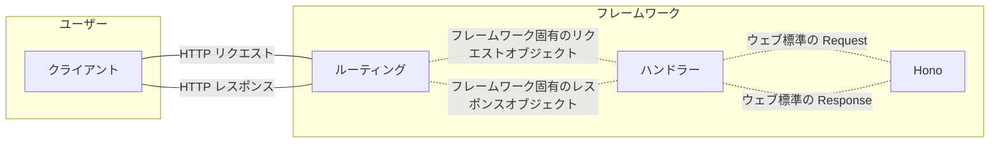

## はじめに

Hono の売りの一つに「[ウェブ標準への準拠](https://hono.dev/docs/concepts/web-standard)」があります。この特徴により、開発者は Hono アプリを様々なプラットフォームへとデプロイすることが可能となっています。これだけでも素晴らしいことですが、Hono 好きの方々はそれでは飽き足らず、Hono がウェブ標準の `Request`/`Response` をやり取りするという事実を利用し、おそらくはもともと想定されていなかったであろう場所でも Hono を使い始めているようです。筆者が特に注目するのは、以下の記事のように Hono を Next.js などフロントエンドのメタフレームワークに組み込むような試みです:

https://zenn.dev/chot/articles/e109287414eb8c

こうした文章を読み、「これは色々なフロントエンドフレームワークに応用できそうだ」と考え、Next.js だけではなく Astro や Nuxt などでも Hono を動かす実験をおこない、それをまとめた結果がこの記事となります。この記事を読めば、「フロントエンド寄りの開発でも Hono が書きたいんじゃ！」というわがままな欲求^[実際のところ、プロトタイピングフェーズでさっと API を定義したい場合などには便利でしょうし、またフレームワーク固有の知識がなくとも Hono の書き方を知っていれば API を記述できるともいえるため、単なる遊びの枠を超えて有用である可能性もあるかもしれません。]が満たせる、あるいはそのためのヒントが得られることでしょう。今回は以下の 4 つのフレームワークに Hono を組み込み、Cloudflare Pages へのデプロイまでおこないました^[なお、筆者は Next.js と Astro については多少の経験があるものの、Nuxt はかなり長いこと触っておらず、SvelteKit に至ってはまったくの初見でドキュメントをざっと読んだ程度の知識しかないため、何かおかしなことをしていた場合はコメントなどで指摘してもらえると嬉しいです。]:

- Next.js
  - [デモ](https://hono-next-demo.pages.dev/)
  - [ソースコード](https://github.com/morinokami/hono-anywhere/tree/main/apps/next)
- Astro
  - [デモ](https://hono-astro-demo.pages.dev/)
  - [ソースコード](https://github.com/morinokami/hono-anywhere/tree/main/apps/astro)
- Nuxt
  - [デモ](https://hono-nuxt-demo.pages.dev/)
  - [ソースコード](https://github.com/morinokami/hono-anywhere/tree/main/apps/nuxt)
- SvelteKit
  - [デモ](https://hono-sveltekit-demo.pages.dev/)
  - [ソースコード](https://github.com/morinokami/hono-anywhere/tree/main/apps/sveltekit)

各プロジェクトをまとめたリポジトリは以下となります:

https://github.com/morinokami/hono-anywhere


## 作戦

ここでは Hono を様々なフレームワーク上で動作させるためにどうすればいいか、その大筋について考えていきましょう。

Hono インスタンスには [`fetch`](https://hono.dev/docs/api/hono#fetch) という API が用意されており、これは Hono アプリのエントリーポイントとなります。この `fetch` をフレームワーク側から動的に呼び出すことにより、Hono アプリをフレームワーク内で動かせそうだという当たりがまずつけられます。

`fetch` のシグネチャは

```ts
(request: Request, Env?: E["Bindings"] | {}, executionCtx?: ExecutionContext) => Response | Promise<Response>
```

となっています。必須の引数は `request` ですが、上述したようにこの引数の型はウェブ標準の [`Request`](https://developer.mozilla.org/en-US/docs/Web/API/Request) と同じものであるため、フレームワーク側は自身のリクエストオブジェクトをウェブ標準の `Request` に変換して `fetch` に渡すことで Hono アプリを呼び出せそうです。また `fetch` の返り値についても見てみると、同様に一般的な [`Response`](https://developer.mozilla.org/en-US/docs/Web/API/Response) オブジェクトを返すことがわかります。よって、フレームワーク側は `fetch` の返り値を自身のレスポンスオブジェクトに変換することで、Hono アプリのレスポンスをフレームワークのレスポンスとして返せそうだということも想像できます。

ところで、多くのフレームワークには一般に、API Routes や Route Handlers などのように名称こそ異なるものの、HTTP リクエストに対するサーバーサイドの処理をハンドラーとして登録するための仕組みが用意されています。つまり、上で述べたような `fetch` の呼び出しやその返り値の変換をこのハンドラー内でおこなえば、目標は達成できそうだということがわかります。

ここまでのイメージを図示すると以下のようになります:



以下でおこなう作業は、上のイメージを各フレームワークに合わせて実装へと落とし込むこととなります。フレームワークごとに多少の差異はあれど、「リクエストハンドラーにおいてフレームワークと Hono の中継をおこなう」という同一のパターンが連続することに注目して続きを読み進めてみてください。


## Next.js

[Next.js](https://nextjs.org/) の App Router には、HTTP リクエストを処理するカスタムハンドラーを登録するための仕組みとして [Route Handlers](https://nextjs.org/docs/app/building-your-application/routing/route-handlers) が用意されています。たとえば `app/api/` に `route.ts` という名前のファイルを作成し、

```ts:app/api/route.ts
export async function GET(request: Request) {
  // ...
}
```

のように HTTP メソッドと同名の関数をエクスポートすることで、`/api` へのリクエストに対するハンドラーを登録できます。

Next.js の Route Handlers の引数はウェブ標準の `Request` を拡張した [`NextRequest`](https://nextjs.org/docs/app/api-reference/functions/next-request) であり、また返り値にはウェブ標準の `Response` を使用できます。つまり、Hono の `fetch` に引数の `request` を直接渡し、その返り値をそのまま Route Handlers のレスポンスとして返すことで、Hono アプリを Next.js 上で動かせます。ここでは Hono とやり取りするための特別な変換処理は必要ありません。

また、Next.js のルーティングでは [Catch-all Segments](https://nextjs.org/docs/app/building-your-application/routing/dynamic-routes#catch-all-segments) という機能を使うことで、そのセグメント以下のパスに対するリクエストをすべて同じハンドラーに渡すことができます。これにより、たとえば `app/api/[...route]/route.ts` のようにファイルを作成すれば、`/api/foo` や `/api/foo/bar` などへのリクエストをすべて同じハンドラーで処理することが可能となるため^[`/api` にもマッチさせたい場合は、Optional Catch-all Segments を使用して `app/api/[[...route]]/route.ts` と設定してください。]、Hono アプリに `/api` 以下へのすべてのリクエストを渡すことができます。

それでは、実際に Route Handler を定義してみましょう。ここでは上で述べたように `/api` 以下のリクエストを Hono で処理することとするため、`app/api/[...route]/route.ts` を作成し以下のように記述します:

```ts:app/api/[...route]/route.ts
import { Hono } from "hono";

const app = new Hono()
  .basePath("/api") // /api 以下のリクエストを処理するため、basePath を設定
  .get("/hello", async (c) => {
    return c.json({ message: "Hello from Hono!" });
  })
  .get("/hello/:name", async (c) => {
    const name = c.req.param("name");
    return c.json({ message: `Hello, ${name}!` });
  });

export type App = typeof app; // hc に渡す型

export const GET = app.fetch; // GET リクエストを Hono に渡す
```

ほぼ通常の Hono のコードですが、最後の行に注目してください。ここでは `GET` という名前の変数をエクスポートしているため、`/api` 以下への GET リクエストはこの変数が指す関数が処理することとなります。`GET` には Hono の `fetch` をそのまま設定しているため、ここでの処理は結局 `app.fetch(request)` と同じ内容が実行されることになります。この一行が一番のポイントです。

この時点で API は機能しますが、この API から受け取ったデータを表示するようなページも作成しておきましょう。`app/page.tsx` の内容を以下のように書き換えます:

```tsx:app/page.tsx
import { hc } from "hono/client";

import { App } from "./api/[...route]/route";

export default async function Home() {
  const client = hc<App>("http://localhost:3000/");

  const response = await client.api.hello.$get();
  const { message } = await response.json();

  return (
    <>
      <h1>Hono + Next.js</h1>
      <p>{message}</p>
      <p>View <a href="/api/hello/world">the API response</a></p>
    </>
  );
}
```

Hono には RPC クライアントを生成するための [`hc`](https://hono.dev/docs/guides/rpc) 関数が存在し、これを使うと型安全に Hono アプリにリクエストを送信できます。上のページでは、`hc` を使って Hono アプリにリクエストを送信し、そのレスポンスをもとにページを SSR しています。このページの表示結果は以下のようになります:


「Hello from Hono!」と画面に表示されており、Hono からレスポンスを正しく取得できていることがわかります。また、`/api/hello/world` へのリンクをクリックすると、Hono から直接 JSON データ `{"message":"Hello, world!"}` を取得できるはずです。

このようにして作成した Hono + Next.js アプリは、[`@cloudflare/next-on-pages`](https://github.com/cloudflare/next-on-pages) を使用して Cloudflare Pages にデプロイすることも可能です。少し調整すれば [Vercel](https://hono.dev/docs/getting-started/vercel) など他のホスティングサービスへもデプロイできることでしょう。


## Astro

[Astro](https://astro.build/) には、サーバーサイドで実行される API を定義するための機能として [Endpoints](https://docs.astro.build/en/guides/endpoints/) が用意されています。Endpoints を使用するには、`src/pages` ディレクトリ以下に `.js` または `.ts` ファイルを作成し、そこから HTTP メソッドと同名の関数をエクスポートします。また、Astro では `[...route].ts` のようなファイル名を使うことで、Next.js の Catch-all Segments のようにそのセグメント以下のパスに対するリクエストをすべて同じハンドラーに渡すことができます。ただし、たとえば `src/pages/api/[...route].ts` というファイルを作成すると、`/api/foo` や `/api/foo/bar` だけでなく `/api` にもマッチするため、どちらかというと Next.js の [Optional Catch-all Segments](https://nextjs.org/docs/app/building-your-application/routing/dynamic-routes#optional-catch-all-segments) に近い挙動となることに注意してください。

Astro の Endpoints に渡されるデータは、ウェブ標準の `Request` ではなく [`context`](https://docs.astro.build/en/reference/api-reference/) オブジェクトです:

```ts
import type { APIContext } from "astro";

export function GET(context: APIContext) {
  // ...
}
```

このオブジェクトには動的なルートセグメントを保持する [`params`](https://docs.astro.build/en/reference/api-reference/#params) や、クライアントの IP アドレスを保持する [`clientAddress`](https://docs.astro.build/en/reference/api-reference/#clientaddress) など様々な値が含まれています。幸い、その中にウェブ標準の `Request` が [`request`](https://docs.astro.build/en/reference/api-reference/#request) として含まれているため、これをそのまま Hono に渡すことができます。また、Endpoints はウェブ標準の `Response` を返り値として受け付けるため、ここでも Hono の `fetch` の返り値をそのまま返すことが可能です。

Next.js 版と同様の API を定義してみましょう。そのためには、`src/pages/api/[...route].ts` を作成し、以下のように記述します:

```ts:src/pages/api/[...route].ts
import type { APIRoute } from "astro";
import { Hono } from "hono";

const app = new Hono()
  .basePath("/api")
  .get("/hello", async (c) => {
    return c.json({ message: "Hello from Hono!" });
  })
  .get("/hello/:name", async (c) => {
    const name = c.req.param("name");
    return c.json({ message: `Hello, ${name}!` });
  });

export type App = typeof app;

export const GET: APIRoute = (context) => app.fetch(context.request);
```

Next.js 版のコードとほとんど違いはありませんが、`GET` の実装が微妙に異なっています。上で述べたように、Astro の Endpoints は `context` オブジェクトを引数に取るため、それを受け取り Hono の `fetch` に `Request` を引き渡す関数を `GET` として定義しています。これにより、`/api` 以下のパスに対する GET リクエストの処理はこの関数が担当することとなります。

Astro 版のページは以下となります:

```tsx:src/pages/index.astro
---
import { hc } from "hono/client";

import type { App } from "./api/[...route]";

const client = hc<App>("http://localhost:4321/");

const response = await client.api.hello.$get();
const { message } = await response.json();
---

<!doctype html>
<html lang="en">
  <head>
    <meta charset="UTF-8" />
    <meta name="viewport" content="width=device-width" />
    <link rel="icon" type="image/svg+xml" href="/favicon.svg" />
    <meta name="generator" content={Astro.generator} />
    <title>Hono + Astro</title>
  </head>
  <body>
    <h1>Hono + Astro</h1>
    <p>{message}</p>
    <p>View <a href="/api/hello/world">the API response</a></p>
  </body>
</html>
```

Astro ではコードフェンスと呼ばれる `---` で囲まれた領域に JavaScript コードが書けるため、ここで Hono クライアントを生成し、API からのレスポンスを取得しています。API から受け取ったデータ `message` はコードフェンス下部のテンプレート内で使用できるため、これをそのまま画面に表示し、Next.js 版と同様の内容を表示しています。


## Nuxt

[Nuxt](https://nuxt.com/) では、サーバーサイドにおいて実行される処理を [`server/`](https://nuxt.com/docs/guide/directory-structure/server) ディレクトリ以下に配置します。特に `server/api/` 以下に配置したファイルは [Server Routes](https://nuxt.com/docs/guide/directory-structure/server#server-routes) と呼ばれ `/api/*` へとマッピングされるため、たとえば `server/api/hello.ts` を用意しておけば `/api/hello` へのアクセスをハンドリングすることが可能です。また、`[...].ts` というファイル名により [Catch-all Route](https://nuxt.com/docs/guide/directory-structure/server#catch-all-route) を実現できるため、これまでと同じように `/api` 以下のすべてのリクエストを同じハンドラーで処理するには `server/api/[...].ts` というファイルを作成すればよいことになります。

Server Routes を実装するためには `defineEventHandler` 関数を使用しますが、Nuxt は内部で [Nitro](https://nitro.build/) というサーバーサイドフレームワークを使用しており、さらにその内部では [h3](https://h3.unjs.io/) という HTTP フレームワークが使用されている点に注意が必要です。こうした事情により、`defineEventHandler` の引数に指定するリクエストハンドラーに渡される引数は、ウェブ標準の `Request` ではなく h3 の `H3Event` オブジェクトとなっています。よって、Hono を呼び出すためにはこの `H3Event` オブジェクトを `Request` に変換する必要がありますが、h3 にはまさにそのために [`toWebRequest`](https://h3.unjs.io/utils/request#towebrequestevent) という関数が用意されているため、今回はこれを使って `Request` を取得することとします。

`server/api/[...].ts` を作成し、以下のように記述しましょう:

```ts:server/api/[...].ts
import { Hono } from "hono"

const app = new Hono()
  .basePath('/api')
  .get("/hello", async (c) => {
    return c.json({ message: "Hello from Hono!" })
  })
  .get("/hello/:name", async (c) => {
    const name = c.req.param("name");
    return c.json({ message: `Hello, ${name}!` });
  })

export type App = typeof app;

export default defineEventHandler(async (event) => {
  const req = toWebRequest(event) // H3Event から Request を取得
  return app.fetch(req) // Hono に Request を渡す
})
```

上で述べた通り、`defineEventHandler` の引数には `H3Event` オブジェクトが渡されるため、これを `toWebRequest` で `Request` に変換し Hono に渡すことで API を実装しています。その他の実装はこれまでと完全に同じです。

ページ側の実装は以下となります:

```vue:app.vue
<script setup lang="ts">
import { hc } from "hono/client";

import type { App } from "~/server/api/[...]";

useHead({
  title: "Hono + Nuxt", // ページタイトルを設定
});

const client = hc<App>("http://localhost:3000/");

const response = await client.api.hello.$get();
const { message } = await response.json();
</script>

<template>
  <h1>Hono + Nuxt</h1>
  <p>{{ message }}</p>
  <p>View <a href="/api/hello/world">the API response</a></p>
</template>
```

Vue では [`<script setup>`](https://vuejs.org/api/sfc-script-setup.html) によりコンポーネントのロジックを記述するため、ここで Hono クライアントを生成し、API からのレスポンスを取得しています。取得したデータをテンプレート内で表示することで、これまでと同様の内容を画面に表示しています。


## SvelteKit

[SvleteKit](https://svelte.dev/docs/kit/introduction) では、`src/routes` ディレクトリをルートとするファイルベースルーティングが採用されています。このディレクトリ以下で、[`+page.svelte`](https://svelte.dev/docs/kit/routing#page) というファイルはそれが置かれるディレクトリへのパスに対応するページとなり、また [`+server.ts`](https://svelte.dev/docs/kit/routing#server) というファイルはサーバーサイドのエンドポイントとなります。また、`[...route]` のようなディレクトリを作成し [Rest parameters](https://svelte.dev/docs/kit/advanced-routing#Rest-parameters) を使用することで、他のフレームワークと同様にそのセグメント以下のパスに対するリクエストをすべて同じハンドラーで処理することができます。

`+server.ts` から GET や POST など HTTP メソッド名に対応する関数をエクスポートすることで、そのメソッドに対するリクエストを処理することができます。この関数には `RequestEvent` というオブジェクトが渡されますが、ここにウェブ標準の `Request` が `request` という名前のプロパティとして含まれているため、他のフレームワークと同様にこれを Hono に渡して API を実装していきます。

`src/routes/api/[...route]/+server.ts` を作成し、以下のように記述しましょう:

```ts:src/routes/api/[...route]/+server.ts
import { Hono } from "hono";

import type { RequestHandler } from './$types';

const app = new Hono()
  .basePath("/api")
  .get("/hello", async (c) => {
    return c.json({ message: "Hello from Hono!" });
  })
  .get("/hello/:name", async (c) => {
    const name = c.req.param("name");
    return c.json({ message: `Hello, ${name}!` });
  });

export type App = typeof app;

export const GET: RequestHandler = ({ request }) => app.fetch(request);
```

これまでと同様のパターンであるため、もはや説明は不要でしょう。

続いてページ側の実装に移りますが、SvleteKit では [`+page.server.ts`](https://svelte.dev/docs/kit/routing#page-page.server.js) というファイルを `+page.svelte` と同階層に置くことで、そのページが利用するサーバーサイドのデータローダーを指定できますので、まずはこのファイルを作成して Hono との通信処理を記述することにします:

```ts:src/routes/+page.server.ts
import { hc } from "hono/client";

import type { PageServerLoad } from './$types';
import type { App } from "./api/[...route]/+server";

export const load: PageServerLoad = async () => {
  const client = hc<App>("http://localhost:5173/");

  const response = await client.api.hello.$get();
  const { message } = await response.json();

  return {
    message,
  }
};
```

ページ側でこのデータを受け取り（`const { data } = $props();`）、画面に表示します:

```html:src/routes/+page.svelte
<script lang="ts">
  const { data } = $props();
</script>

<svelte:head>
  <title>Hono + SvelteKit</title>
</svelte:head>

<h1>Hono + SvelteKit</h1>
<p>{data.message}</p>
<p>View <a href="/api/hello/world">the API response</a></p>
```

記述する場所こそ異なれど、やはりここでも `hc` を初期化し API からのレスポンスを取得するロジックは同じであることが確認できました。


## おわりに

Hono がウェブ標準の `Request` と `Response` をやり取りするという特性を活かすことで、Hono を様々なフロントエンドのメタフレームワーク上で動かせることをここまで見てきました。今回は Next.js、Astro、Nuxt、そして SvelteKit という 4 つのフレームワークを例として取り上げましたが、同様の発想により他のフレームワークに Hono を組み込むことも可能でしょう。ぜひ自分の推しフレームワークでも Hono と組み合わせられないか試してみてください。
