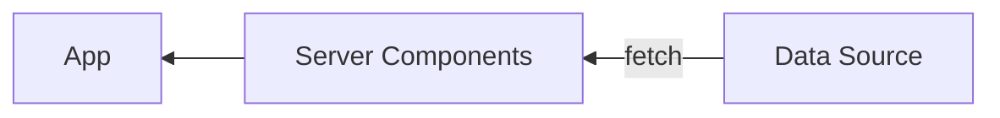
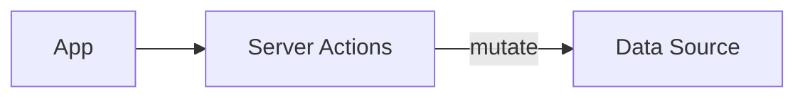

## はじめに

今年の春頃に発表された Server Actions ですが、Next.js 14 の発表を機に実際に使い始めてみるとまだまだ情報が少なく、また React や Next.js の公式ドキュメントを中心に色々な情報源を行ったり来たりする必要性を感じました。ただ、そのように断片的ながらも色々な情報を吸収しながらコードを書いていくうちに、Server Actions に関して最低限押さえておくべき事項の全体像が見えてきたため、ここに文書としてまとめておこうと思います。Server Actions の使い方を理解する上で個人的に重要だと思った文書は末尾に[参考](#参考)としてまとめてありますので、この記事を起点にぜひそれらも読んでみてください。

なお余談ですが、Server Actions に関するミームが X 上で少し前に流行っていましたね。震源は

https://twitter.com/adamrackis/status/1717607565260124613

だと思いますが、クライアントから直接 SQL クエリを実行するという見た目が多くの人々に衝撃を与えたようです。果てには Vercel CEO の Guillermo Rauch が悪ノリでミームジェネレータまで作ってしまい、これら一連の展開はなかなか楽しいものでした:

https://twitter.com/rauchg/status/1718416777322123645


## Server Actions とは何か

[Server Actions](https://nextjs.org/docs/app/api-reference/functions/server-actions) とは、クライアント側から呼び出される、サーバーサイドで実行可能な関数です。いわゆる RPC (Remote Procedure Call) の仕組みが React の世界にもたらされたものであるといえます。[Server Components](https://github.com/reactjs/rfcs/blob/main/text/0188-server-components.md) が data fetching をサーバーサイドに移動するための仕組みと考えると、Server Actions は data mutation をサーバーサイドに移動するために導入された仕組みであり、両者は相補的な関係となっています。サーバーサイドにおける data fetching や data mutation の仕組みは従来、[`getServerSideProps`](https://nextjs.org/docs/pages/building-your-application/data-fetching/get-server-side-props) や [`loader`](https://remix.run/docs/en/main/route/loader)、[API Routes](https://nextjs.org/docs/pages/building-your-application/routing/api-routes) など、各フレームワーク独自の方式により実現されていましたが、Server Components と Server Actions により、正式に React の世界における第一級市民となったといえます。





Server Actions により、

- API レイヤー (Next.js の言葉では API Routes あるいは Route Handlers) を介さず直接サーバーサイドの関数をコンポーネントから実行できる
- ほげ

などの効用がもたらされることが期待されています^[TODO: (消す) Server Actions がもたらす恩恵については、Next.js 14 のアナウンスメント https://nextjs.org/blog/next-14#forms-and-mutations や、日本語であれば https://azukiazusa.dev/blog/why-use-server-actions/ がよくまとまっています]。


## サポート状況

2023 年 10 月 5 日、React の Canary 版に Server Actions のサポートが[追加](https://github.com/facebook/react/blob/main/CHANGELOG-canary.md#october-5-2023-1830-canary-546178f91-20231005)されました。React の Canary 版は[フレームワークにとっての安定版である](https://react.dev/blog/2023/05/03/react-canaries)とみなされるので、この時点で各 React フレームワークが Server Actions を正式にサポートするための前提が整ったといえます。そしてこれを受け、Next.js はバージョン 14 において Server Actions のサポート段階を [Stable へと引き上げ](https://nextjs.org/blog/next-14)ました。この記事を書いている段階で Server Actions をサポートしている Next.js 以外のフレームワークはないため、以下でコード例などを提示する際は Next.js プロジェクトにおいて実行されることを前提としています。


## `'use server'`

さて、概念としての Server Actions についてざっくり理解できたところで、ここからは具体的に Server Actions の実装方式や実行方式について説明していきます。ですがその前の準備として、`'use server'` というディレクティブについて確認しておきます。

React の[ドキュメント](https://react.dev/reference/react/use-server)によると、

> `'use server'` marks server-side functions that can be called from client-side code.

とあります。これを訳すと「クライアントサイドのコードから呼び出されるサーバーサイドの関数にマークを付ける」といった意味になりますが、この「サーバーサイドの関数」とは Server Actions のことです。つまり、`'use server'` というディレクティブは、「ここからは Server Actions ですよ」というメッセージを React に伝える役割をもちます。[`'use client'`](https://react.dev/reference/react/use-client) が、あるファイルとそこから `import` されるコンポーネント群が Client Components であることを伝える、つまり Server Components と Client Components の境界にマークを付けるために使用されるのと同様に、`'use server'` はコンポーネントとサーバーサイドの処理の境界にマークを付けるために使用されます。


## 実装方式

Server Actions の[実装方式](https://nextjs.org/docs/app/api-reference/functions/server-actions#convention)には、以下の二種類があります:

- Server Components と同じファイルに定義する方式
- 単独のファイルに定義する方式

### Server Components と同じファイルに定義する方式

この場合、コンポーネントと同じファイルに非同期関数を定義し、その先頭に `'use server'` を記述します (以下は Next.js のドキュメントからの抜粋です):

```tsx
export default function ServerComponent() {
  async function myAction() {
    'use server'
    // ...
  }
}
```

ここで定義した `myAction` は、`'use server'` ディレクティブにより Server Action であると認識されるため、サーバーサイドで実行されることが保証されます。

また、上で示した SQL クエリを実行するコードも、Server Components の中に直接定義されているためこちらの分類となります (後述する `formAction` の中に直接定義されている非同期のアロー関数が Server Action です):

```tsx
function Bookmark({ slug }) {
  return (
    <button
      formAction={async () => {
        "use server";
        await sql`INSERT INTO Bookmarks (slug) VALUES (${slug})`;
      }}
    >
      <BookmarkIcon>
    </button>
  )
}
```

なお、同じファイルであれば以下のようにコンポーネントの外側に置いても構いません:

```tsx
async function myAction() {
  'use server'
  // ...
}

export default function ServerComponent() {
  // ...
}
```

### 単独のファイルに定義する方式

この場合、Server Actions を定義するファイルの先頭に `'use server'` を記述し、非同期の関数を定義していきます。一つのファイルに複数の Server Actions を定義することも可能です。

```ts
'use server'
 
export async function myAction() {
  // ...
}
```

異なるファイルへと Server Actions を分離することで、

- 同じ Action を使い回せる
- サーバーサイドでのみ実行されるコードがハッキリするため可読性やメンテナビリティが向上する

などのメリットがあると考えられます。

### TODO: 引数の `bind`


## 実行方式

続いて、Server Actions の[実行方式](https://nextjs.org/docs/app/api-reference/functions/server-actions#invocation)について説明していきます。Server Actions の実行方式には、以下の三種類があります:

- `action` prop を使用する方式
- `formAction` prop を使用する方式
- Custom Invocation による方式

### `action` prop を使用する方式

`<form>` 要素の [`action`](https://react.dev/reference/react-dom/components/form#props) prop に Server Actions を指定することで、フォームの送信時に指定した Server Actions が実行されるようになります。以下は、ユーザー名を送信するフォームを定義し、送信されたユーザー名をサーバーサイドでログに出力する例です。`logUsername` には [FormData](https://developer.mozilla.org/en-US/docs/Web/API/FormData) が自動的に渡されます:

```tsx:page.tsx
async function logUsername(formData: FormData) {
  "use server";
  const username = formData.get("username");
  console.log(username);
}

export default function FormApp() {
  return (
    <form action={logUsername}>
      <input type="text" name="username" />
      <button type="submit">送信</button>
    </form>
  );
}
```

### `formAction` prop を使用する方式

`form` 要素内に置かれた

- `button`
- `<input type="submit">`
- `<input type="image">`

の [`formAction`](https://react.dev/reference/react-dom/components/input#props) prop に Server Actions を指定することもできます。`form` の `action` と同時に指定された場合、`formAction` が優先されます。以下は `action` と `formAction` を実験として同時に指定した場合の例ですが、`action` に指定された `action1` は、`formAction` に指定された `action2` にオーバーライドされるため、実際には `action2` のみ実行されます:

```tsx:page.tsx
async function action1(formData: FormData) {
  "use server";
  const username = formData.get("username");
  console.log("action1", username);
}

async function action2(formData: FormData) {
  "use server";
  const username = formData.get("username");
  console.log("action2", username);
}

export default function FormApp() {
  return (
    <form action={action1}>
      <input type="text" name="username" />
      <button type="submit" formAction={action2}>
        送信
      </button>
    </form>
  );
}
```

なお、上では一方がオーバーライドされる例を示しましたが、`action` と `formAction` を同時に指定できることを利用し、一つのフォームで複数の Server Actions を実行することも可能です。詳しくは React の[公式ドキュメント](https://react.dev/reference/react-dom/components/form#handling-multiple-submission-types)を参照してください。

### Custom Invocation による方式

`action` や `formAction` などを経由せず、ユーザーインタラクションを起点に Server Actions を実行することも可能です。Next.js のドキュメントでは、これを Custom Invocation と呼んでいます (React 側の用語ではありません)。Custom Invocation をおこなう場合、UX の観点から [`useTransition`](https://react.dev/reference/react/useTransition) フックを用いて transition の中で Server Actions を実行することが[推奨されています](https://react.dev/reference/react/use-server#calling-a-server-action-outside-of-form)。以下は React の公式ドキュメントのコード例からの抜粋です:

```tsx
import incrementLike from './actions';
import { useState, useTransition } from 'react';

function LikeButton() {
  const [isPending, startTransition] = useTransition();
  const [likeCount, setLikeCount] = useState(0);

  const onClick = () => {
    startTransition(async () => {
      const currentCount = await incrementLike();
      setLikeCount(currentCount);
    });
  };

  return (
    <>
      <p>Total Likes: {likeCount}</p>
      <button onClick={onClick} disabled={isPending}>Like</button>;
    </>
  );
}
```

```ts
// actions.js
'use server';

let likeCount = 0;
export default async incrementLike() {
  likeCount++;
  return likeCount;
}
```

この例では、`onClick` イベントハンドラーの内部で直接 `incrementLike` を呼び出しています。また、これまでの例と異なり、`incrementLike` が通常の関数のように値を返しており、クライアント側でその値を受け取って使用していることも重要です。Custom Invocation では通常の関数と同じように Server Actions を呼び出すため、その返り値をそのまま受け取ることができるのです。ただし、`action` や `formAction` で Server Actions の実行結果を受け取ることができないというわけではなく、代わりに `formState` などのフックを使用して実行結果を取得します。これについては後述します。

なお、`useTransition` フックは、UI をブロックせずに


## Progressive Enhancement

Wikipedia によると、[Progressive Enhancement](https://en.wikipedia.org/wiki/Progressive_enhancement) とは

> Progressive enhancement is a strategy in web design that puts emphasis on web content first, allowing everyone to access the basic content and functionality of a web page, whilst users with additional browser features or faster Internet access receive the enhanced version instead.

ということを意味します。つまり、ウェブページの基本的なコンテンツや機能にすべてのユーザーがアクセスできるようにすることをベースラインとし、その上でユーザーの環境に応じて段階的に (progressive) 体験を拡張する (enhance) ということです。Server Actions の文脈においては、JavaScript が無効になっている環境においてもフォームの送信が可能であることがベースラインとなるでしょう。そして JavaScript が有効であれば、たとえばフォームの送信後にフルページのリロードをおこなわずに結果を画面に反映させるなど、よりリッチな体験を提供することを考えます。

上述したように、Server Actions の実行形式には

- `action` prop を使用する方式
- `formAction` prop を使用する方式
- Custom Invocation による方式

という三方式がありますが、`action` と `formAction` を使用する方式であれば Progressive Enhancement が有効化されます。つまり、JavaScript が無効な環境であっても、通常の HTML のフォームとして振る舞うためデータの送信が可能となります。一方、Custom Invocation による方式ではイベントハンドラーの中で Server Actions を呼び出すため、JavaScript が無効な環境ではフォームの送信ができず、Progressive Enhancement は無効化されます。よって、Progressive Enhancement の観点からは、Custom Invocation は他の選択肢と比較して望ましくないといえるでしょう。

なお、Progressive Enhancement の議論をする際、上でも書いたように「JavaScript が無効な環境」が仮定されることが多い気がしますが、これは少しミスリーディングであると思われます。というのも、現代では大多数のユーザーは JavaScript を有効化しているため、「そこまでする意味があるのか」という疑問がすぐさま頭に浮かんでくるためです。こうした疑問点を解消するために少し補足すると、ここで念頭に置くべきは、「JavaScript を明示的に無効化している一部のユーザー」だけではなく、「JavaScript のロード・Hydration を待つことになる大多数のユーザー」です。ユーザーが JavaScript を有効化していたとしても、Progressive Enhancement が考慮されていないアプリケーションであれば、Hydration が完了するまでのあいだはインタラクティブな操作ができません。ブラウザ上での初期レンダリングから Hydration が完了するまでの時間はゼロにはならないということ、そしてネットワーク環境は多くのユーザーにとって依然として不安定であり、Hydration が完了するまでの時間が増加する可能性は誰にでもあるということを考えると、Progressive Enhancement は依然として重要な考え方であることがわかるでしょう。

実はこうした説明は、Next.js のドキュメントよりも [Remix のドキュメント](https://remix.run/docs/en/main/discussion/progressive-enhancement#resilience-and-accessibility)に端的にわかりやすく書かれています。最後に、筆者が特に気に入っている文章をそこから引用しておきます:

> While your users probably don't browse the web with JavaScript disabled, everybody has JavaScript disabled until it has finished loading. As soon as you begin server rendering your UI, you need to account for what happens when they try to interact with your app before JavaScript has loaded.


## useFormState と useFormStatus

### useFormState

さて、ここまでの説明により、Server Actions を定義して実際に呼び出すことができるようになりました。ところで、`action` や `formAction` によって Server Actions を実行できるわけですが、一般に何らかの処理をおこなう際にはその実行結果の確認もセットとなります。たとえば、フォームから送信されたデータが適切でない場合や、Server Actions 内で実行した DB 操作が失敗し処理が継続できなくなった場合などにおいて、実行した側のコードにその旨を伝達する場合などです。上述したように、Custom Invocation を用いた場合は例外的に Server Actions の戻り値をそのまま受け取ることができるのですが、`action` や `formAction` を用いた場合は各 prop に Server Action を直接渡しているため、Custom Invocation のように戻り値を受け取ることはできません。こうした場合に Server Actions の実行結果を受け取るために用意されているフックが [`useFormState`](https://react.dev/reference/react-dom/hooks/useFormState) です。

`useFormState` は、

- Server Action そのもの^[なお、実際は Server Actions ではない通常の関数を指定することも可能です。]
- フォームの実行結果の初期値を表わす状態

を引数として受け取り、

- 現在のフォームの状態
- Server Action を実行するための関数

を返します (これは [`useReducer`](https://react.dev/reference/react/useReducer) と似ていますね)。つまり、

```ts
const [state, dispatch] = useFormState(action, initialState);
```

のように使います。`dispatch` をフォームの `action` などにセットして実行することで、Server Action の実行結果をもとに `state` が更新されるため、`state` を通じて実行結果にアクセスできるようになります。

簡単な例で具体的に確認してみましょう。以下は、初期状態を 0 とし、状態を 1 だけ増加させる Server Action を実行するボタンと、その結果を表示するコンポーネントの例です:

```tsx:page.tsx
"use client";

import { useFormState } from "react-dom";
import { increment } from "./actions";

export default function StatefulForm() {
  const [state, dispatch] = useFormState(increment, 0);
  return (
    <form>
      {state}
      <button formAction={dispatch}>+1</button>
    </form>
  );
}
```

そして以下が上で使用している Server Action の実体である `increment` の実装となります。これまでの実装と異なり、第一引数に直前の状態を表わす `prevState` が渡され、第二引数に `formState` が渡されることに注意してください:

```ts:actions.ts
"use server";

export async function increment(prevState: number, formData: FormData) {
  return prevState + 1;
}
```

以上のコードを動かしてみると、ボタンをクリックするたびにサーバーにリクエストが飛び、Server Action の実行結果が画面に反映されます。このように、`useFormState` を用いてフォームの状態を保持し、Server Actions の実行結果を画面に反映させることができます。

また、`useFormState` は Progressive Enhancement にも対応しています。実際、ブラウザの設定で JavaScript を無効化した上でボタンをクリックすると、フォームが送信され、次の値が埋め込まれた HTML がブラウザにレンダリングされることが確認できるはずです。

このように、`useFormState` により、Server Actions からフォームへのコミュニケーションが可能となります。以下でまた詳しく説明しますが、この応用としてフォームから送信されたデータのバリデーション結果の表示なども実現できます。

なお、Server Actions から返すことができるのは[シリアライズ](https://developer.mozilla.org/en-US/docs/Glossary/Serialization)可能な値に限定されることに注意してください。たとえば Date オブジェクトなどはシリアライズできないため、Server Actions から返すことはできません。

### useFormStatus

[`useFormStatus`](https://react.dev/reference/react-dom/hooks/useFormStatus) は、フォームの送信状態に関する情報を取得するためのフックです (`useFormState` と名前が似ているため注意してください)。`useFormState` を用いればフォームを送信した結果について知ることはできますが、たとえばボタンの連打を防ぐために「フォームの値を送信し、その結果を待っている」かどうかを判定したい場合などには対応できません。`useFormStatus` により、そうしたフォームの送信状態に関する情報を利用することができるようになります。

具体的な使用法は以下のようになります:

```ts
const { pending, data, method, action } = useFormStatus();
```

返り値の意味はそれぞれ以下の通りです:

- `pending`: フォームの実行結果を待っている場合は `true`、完了している場合は `false`
- `data`: フォームから送信されたデータ
- `method`: フォームの送信に使用された HTTP メソッド、`get` または `post` という文字列が入る
- `action`: フォームの `action` prop に渡された Server Action

`useFormStatus` についてはシグネチャを見るとその意図がわかりやすくなるかもしれません。以下は `useFormStatus` の[型定義からの抜粋](https://github.com/DefinitelyTyped/DefinitelyTyped/blob/a35d2b719fd8fbb9d7dc204e70d4dc38b27ebe37/types/react-dom/canary.d.ts#L112-L128)です:

```ts
interface FormStatusNotPending {
  pending: false;
  data: null;
  method: null;
  action: null;
}

interface FormStatusPending {
  pending: true;
  data: FormData;
  method: string;
  action: string | ((formData: FormData) => void | Promise<void>);
}

type FormStatus = FormStatusPending | FormStatusNotPending;

function useFormStatus(): FormStatus;
```

つまり、`useFormStatus` はフォームの送信がペンディング (完了待ち) 状態か (`FormStatusPending | FormStatusNotPending`) をまず大きく表わし、ペンディング状態 (`FormStatusPending`) であれば上述した送信状態に関する情報がセットされ、そうでなければ (`FormStatusNotPending`) それらの情報は `null` (`pending` に関しては `false`) となるということです。この意図を読み取ると、たとえば `pending` を使用して送信ボタンを無効化することなどがこのフックの主要な用途であることがわかります。

ところで、一点注意しなければならないこととして、`useFormStatus` はそれを使うコンポーネントの親コンポーネントの `form` 要素に関する情報を返すということです。すなわち、

```ts:actions.ts
"use server";

export async function action(formData: FormData) {
  await new Promise((resolve) => setTimeout(resolve, 1000));
}
```

のような Server Action があるとき、

```tsx:page.tsx
"use client";

import { useFormStatus } from "react-dom";
import { action } from "./actions";

export default function FormApp() {
  const { pending } = useFormStatus(); // ❌
  return (
    <form action={action}>
      <button disabled={pending}>{pending ? "送信中" : "送信"}</button>
    </form>
  );
}
```

のようには書けないということです。代わりに、`useFormStatus` を使うコンポーネントを新たに作成し、そのコンポーネントを `form` 要素の子要素として配置する必要があります:

```tsx:page.tsx
"use client";

import { useFormStatus } from "react-dom";
import { action } from "./actions";

function Submit() {
  const { pending } = useFormStatus(); // ✅
  return <button disabled={pending}>{pending ? "送信中" : "送信"}</button>;
}

export default function FormApp() {
  return (
    <div>
      <form action={action}>
        <Submit />
      </form>
    </div>
  );
}
```


## バリデーション

下で述べるセキュリティとも関係しますが、Server Actions においても入力値に対するバリデーションは欠かせません。実装の詳細であるため詳しく述べることは避けますが、各 Server Actions には一意の ID が割り振られており、フォームはこの ID の値を裏側で同時に送信し、サーバーサイドでは送信された ID に対応する関数を特定してそれを呼び出す、というのが Server Actions の大まかな仕組みとなっています。このことは、ID を知ってさえいれば任意の引数を渡して Server Actions を呼び出せるということを[意味します](https://nextjs.org/blog/security-nextjs-server-components-actions#write)。これがバリデーションが必要となる理由です。

バリデーション自体は通常の関数と同様、引数が期待する値かどうかを確認すれば良いでしょう。様々な方法が考えられますが、Next.js の [examples](https://github.com/vercel/next.js/blob/canary/examples/next-forms/app/actions.ts) や [チュートリアル](https://nextjs.org/learn/dashboard-app/mutating-data)で使われている [Zod](https://zod.dev/) を用いた方法が現状では Idiomatic であると考えられるため、ここではそれを見てみましょう:

```ts:actions.ts
"use server";

import { z } from "zod";

const FormSchema = z.object({
  id: z.string().min(1),
});

export async function action(formData: FormData) {
  const validatedFields = FormSchema.safeParse({
    id: formData.get("id"),
  });

  if (!validatedFields.success) {
    // バリデーションエラー
  }

  // ...
}
```

まず、フォームから送信されるべき値を `FormSchema` という名前のスキーマにより定義しています。続いて、ここでは `FormData` が引数であるため、[`get`](https://developer.mozilla.org/en-US/docs/Web/API/FormData/get) メソッドを用いてキーに対応する値を取り出し、そこからオブジェクトを組み上げ、スキーマを用いてパースします。この結果を `validatedFields` という変数に保存していますが、バリデーションエラーがあれば `validatedFields.success` が `false` となるため、その場合はエラー処理をおこない、そうでなければ `validatedFields` の値を使って処理を継続する、というのが大まかな流れとなります。話をわかりやすくするためにスキーマを単純化していますが、フォームの要件に応じてスキーマが複雑化したとしても大筋は変わらないはずです。


## エラーハンドリング
https://twitter.com/dan_abramov/status/1725627709387120970: Custom Error は JSON を返し、Unexpected Error は Error Boundary でキャッチすればいいという話
https://speakerdeck.com/mugi_uno/next-dot-js-app-router-deno-mpa-hurontoendoshua-xin


## セキュリティ
https://nextjs.org/blog/security-nextjs-server-components-actions


## フォーム向けライブラリとの併用可能性

### React Hook Form について

[React Hook Form](https://react-hook-form.com) (以下 RHF と呼びます) は、フォームのバリデーションやエラーメッセージの表示などを簡潔に実装するためのライブラリです。`useState` など組み込みの hooks を使用してこれらの機能を素朴に実装することも可能ではありますが、そうした場合、複雑なフォームにおいてはコードが肥大化しメンテナビリティが低下することが通常です。こうしたフォームにまつわる複雑性を軽減してくれることから、RHF は React でフォームを実装する際に併用される人気のライブラリとしての地位を獲得してきました。また DX 面だけでなく、非制御コンポーネントを用いたマウント速度の向上や再描画の抑止など、パフォーマンス面についても重要視しています。

RHF は比較的有名なライブラリであるためその使い方について詳しく述べることはここではしませんが、以下の議論に必要な範囲で典型的なコードを確認しておきましょう。以下はメールアドレスとパスワードを送信するフォームのコード例です。メールアドレスの形式やパスワードの長さが invalid であればエラーを表示し、valid である場合のみ `onSubmit` ハンドラが実行されます。また、ここではバリデーション用のスキーマ定義のために [Valibot](https://valibot.dev/) を使っています。Valibot は tree-shakable かつ code-splittable な [Zod](https://zod.dev/) といった立ち位置のライブラリであり、その軽量さからスキーマを使用したクライアントサイドでのランタイムバリデーションに向いています。RHF では `@hookform/resolvers` というパッケージを通じて外部のバリデーション用ライブラリへのサポートを提供しており、Valibot のサポートも[今年の夏頃に追加](https://github.com/react-hook-form/resolvers/pull/602)されました:

```tsx:App.tsx
import { SubmitHandler, useForm } from "react-hook-form";
import { valibotResolver } from "@hookform/resolvers/valibot";
import { Output, email, minLength, object, string } from "valibot";

const LoginSchema = object({
  email: string([
    minLength(1, "メールアドレスを入力してください。"),
    email("メールアドレスの形式が正しくありません。"),
  ]),
  password: string([
    minLength(1, "パスワードを入力してください。"),
    minLength(8, "パスワードは8文字以上で入力してください。"),
  ]),
});

type LoginFormData = Output<typeof LoginSchema>;

export default function App() {
  const {
    register,
    handleSubmit,
    formState: { errors },
  } = useForm<LoginFormData>({
    resolver: valibotResolver(LoginSchema),
  });

  const onSubmit: SubmitHandler<LoginFormData> = (data) => console.log(data); // => { email, password }

  return (
    <form onSubmit={handleSubmit(onSubmit)}>
      <input {...register("email")} />
      <p>{errors.email?.message}</p>

      <input {...register("password")} />
      <p>{errors.password?.message}</p>

      <input type="submit" />
    </form>
  );
}
```

コードを見ればわかるように、フォームのスキーマを定義し、それをもとに `useForm` を呼び出し、然るべき場所に `register` や `handleSubmit` を配置するだけで、バリデーションやエラーメッセージの表示などの機能を実現できています。これが基本的な RHF の使い方です。RHF を使わず自前で同じことを実装する場合について考えてみると、RHF のありがたさを実感できるはずです。

### Server Actions と組み合わせる
https://github.com/react-hook-form/react-hook-form/issues/10391
https://github.com/orgs/react-hook-form/discussions/10757

### React Hook Form の Server Actions 対応について
https://github.com/react-hook-form/react-hook-form/pull/11061


## 参考

### 公式アナウンスメント

https://react.dev/blog/2023/03/22/react-labs-what-we-have-been-working-on-march-2023
https://nextjs.org/blog/next-13-4
https://nextjs.org/blog/next-14

### 公式文書

https://nextjs.org/docs/app/api-reference/functions/server-actions
https://react.dev/reference/react/use-server
https://react.dev/reference/react-dom/components/form
https://react.dev/reference/react-dom/hooks/useFormState
https://react.dev/reference/react-dom/hooks/useFormStatus
https://nextjs.org/blog/security-nextjs-server-components-actions

### コード例

https://github.com/vercel/next-learn
https://github.com/vercel/next.js/tree/canary/examples/next-forms
https://github.com/leerob/nextjs-postgres-email-client

### (筆者が思う) 信頼できる日本語記事

https://zenn.dev/cybozu_frontend/articles/server-actions-error
https://zenn.dev/cybozu_frontend/articles/server-actions-and-revalidate
https://zenn.dev/cybozu_frontend/articles/server-actions-deep-dive
https://speakerdeck.com/mugi_uno/next-dot-js-app-router-deno-mpa-hurontoendoshua-xin
https://azukiazusa.dev/blog/why-use-server-actions/
https://azukiazusa.dev/blog/use-form-state-to-display-error-messages-in-server-actions-forms/

### Progressive Enhancement

https://en.wikipedia.org/wiki/Progressive_enhancement
https://developer.mozilla.org/en-US/docs/Glossary/Progressive_Enhancement
