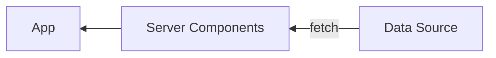
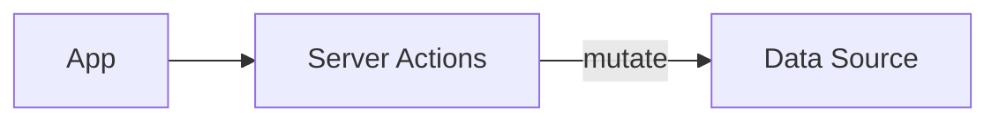

## はじめに

## Server Actions とは何か

[Server Actions](https://nextjs.org/docs/app/api-reference/functions/server-actions) とは、クライアント側から呼び出される、サーバーサイドで実行可能な関数です。いわゆる RPC (Remote Procedure Call) の仕組みが React の世界にもたらされたものであるといえます。[Server Components](https://github.com/reactjs/rfcs/blob/main/text/0188-server-components.md) が data fetching をサーバーサイドに移動するための仕組みと考えると、Server Actions は data mutation をサーバーサイドに移動するために導入された仕組みであり、両者は相補的な関係となっています。サーバーサイドにおける data fetching や data mutation の仕組みは従来、[`getServerSideProps`](https://nextjs.org/docs/pages/building-your-application/data-fetching/get-server-side-props) や [`loader`](https://remix.run/docs/en/main/route/loader)、[API Routes](https://nextjs.org/docs/pages/building-your-application/routing/api-routes) など、各フレームワーク独自の方式により実現されていましたが、Server Components と Server Actions により、正式に React の世界における第一級市民となったといえます。





Server Actions により、

- API レイヤー (Next.js の言葉では API Routes あるいは Route Handlers) を介さず直接サーバーサイドの関数をコンポーネントから実行できる
- ほげ

などの効用がもたらされることが期待されています^[Server Actions がもたらす恩恵については、Next.js 14 のアナウンスメント https://nextjs.org/blog/next-14#forms-and-mutations や、日本語であれば https://azukiazusa.dev/blog/why-use-server-actions/ がよくまとまっています]。

余談ですが、Server Actions に関するミームが X 上で少し前に流行っていましたね。震源は

https://twitter.com/adamrackis/status/1717607565260124613

だと思いますが、クライアントから直接 SQL クエリを実行するという見た目が多くの人々に衝撃を与えたようです。果てには Vercel CEO の Guillermo Rauch が悪ノリでミームジェネレータまで作ってしまい、一連の展開はなかなか楽しいものでした:

https://twitter.com/rauchg/status/1718416777322123645

## サポート状況

2023 年 10 月 5 日、React の Canary 版に Server Actions のサポートが[追加](https://github.com/facebook/react/blob/main/CHANGELOG-canary.md#october-5-2023-1830-canary-546178f91-20231005)されました。React の Canary 版は[フレームワークにとっての安定版である](https://react.dev/blog/2023/05/03/react-canaries)とみなされるので、この時点で各 React フレームワークが Server Actions を正式にサポートするための前提が整ったといえます。そしてこれを受け、Next.js はバージョン 14 において Server Actions のサポート段階を [Stable へと引き上げ](https://nextjs.org/blog/next-14)ました。この記事を書いている段階で Server Actions をサポートしている Next.js 以外のフレームワークはないため、以下でコード例などを提示する際は Next.js プロジェクトにおいて実行されることを前提としています。

## `'use server'`

さて、概念としての Server Actions についてざっくり理解できたところで、ここからは具体的に Server Actions の実装方式や実行方式について説明していきます。ですがその前の準備として、`'use server'` というディレクティブについて確認しておきます。

React の[ドキュメント](https://react.dev/reference/react/use-server)によると、

> `'use server'` marks server-side functions that can be called from client-side code.

とあります。これを訳すと「クライアントサイドのコードから呼び出されるサーバーサイドの関数にマークを付ける」といった意味になりますが、この「サーバーサイドの関数」とは Server Actions のことです。つまり、`'use server'` というディレクティブは、「ここからは Server Actions ですよ」というメッセージを React に伝える役割をもちます。[`'use client'`](https://react.dev/reference/react/use-client) が、あるファイルとそこから `import` されるコンポーネント群が Client Components であることを伝える、つまり Server Components と Client Components の境界にマークを付けるために使用されるのと同様に、`'use server'` はコンポーネントとサーバーサイドの処理の境界にマークを付けるために使用されます。

## 実装方式

Server Actions の[実装方式](https://nextjs.org/docs/app/api-reference/functions/server-actions#convention)には、以下の二種類があります:

- Server Components と同じファイルに定義する方式
- 単独のファイルに定義する方式

### Server Components と同じファイルに定義する方式

この場合、コンポーネントと同じファイルに非同期関数を定義し、その先頭に `'use server'` を記述します (以下は Next.js のドキュメントからの抜粋です):

```tsx
export default function ServerComponent() {
  async function myAction() {
    'use server'
    // ...
  }
}
```

ここで定義した `myAction` は、`'use server'` ディレクティブにより Server Action であると認識されるため、サーバーサイドで実行されることが保証されます。

また、上で示した SQL クエリを実行するコードも、Server Components の中に直接定義されているためこちらの分類となります (後述する `formAction` の中に直接定義されている非同期のアロー関数が Server Action です):

```tsx
function Bookmark({ slug }) {
  return (
    <button
      formAction={async () => {
        "use server";
        await sql`INSERT INTO Bookmarks (slug) VALUES (${slug})`;
      }}
    >
      <BookmarkIcon>
    </button>
  )
}
```

なお、同じファイルであれば以下のようにコンポーネントの外側に置いても構いません:

```tsx
async function myAction() {
  'use server'
  // ...
}

export default function ServerComponent() {
  // ...
}
```

### 単独のファイルに定義する方式

この場合、Server Actions を定義するファイルの先頭に `'use server'` を記述し、非同期の関数を定義していきます。一つのファイルに複数の Server Actions を定義することも可能です。

```ts
'use server'
 
export async function myAction() {
  // ...
}
```

異なるファイルへと Server Actions を分離することで、

- 同じ Action を使い回せる
- サーバーサイドでのみ実行されるコードがハッキリするため可読性やメンテナビリティが向上する

などのメリットがあると考えられます。

## 実行方式

続いて、Server Actions の[実行方式](https://nextjs.org/docs/app/api-reference/functions/server-actions#invocation)について説明していきます。Server Actions の実行方式には、以下の三種類があります:

- `action` prop を使用する方式
- `formAction` prop を使用する方式
- Custom Invocation による方式

### `action` prop を使用する方式

`<form>` 要素の [`action`](https://react.dev/reference/react-dom/components/form#props) prop に Server Actions を指定することで、フォームの送信時に指定した Server Actions が実行されるようになります。以下は、ユーザー名を送信するフォームを定義し、送信されたユーザー名をサーバーサイドでログに出力する例です。`logUsername` には [FormData](https://developer.mozilla.org/en-US/docs/Web/API/FormData) が自動的に渡されます:

```tsx:page.tsx
async function logUsername(formData: FormData) {
  "use server";
  const username = formData.get("username");
  console.log(username);
}

export default function FormApp() {
  return (
    <form action={logUsername}>
      <input type="text" name="username" />
      <button type="submit">送信</button>
    </form>
  );
}
```

### `formAction` prop を使用する方式

`form` 要素内に置かれた

- `button`
- `<input type="submit">`
- `<input type="image">`

の [`formAction`](https://react.dev/reference/react-dom/components/input#props) prop に Server Actions を指定することもできます。`form` の `action` と同時に指定された場合、`formAction` が優先されます。以下は `action` と `formAction` を実験として同時に指定した場合の例ですが、`action` に指定された `action1` は、`formAction` に指定された `action2` にオーバーライドされるため、実際には `action2` のみ実行されます (これは ESLint で警告が出てほしいですね):

```tsx:page.tsx
async function action1(formData: FormData) {
  "use server";
  const username = formData.get("username");
  console.log("action1", username);
}

async function action2(formData: FormData) {
  "use server";
  const username = formData.get("username");
  console.log("action2", username);
}

export default function FormApp() {
  return (
    <form action={action1}>
      <input type="text" name="username" />
      <button type="submit" formAction={action2}>
        送信
      </button>
    </form>
  );
}
```

### Custom Invocation による方式

`action` や `formAction` などを経由せず、ユーザーインタラクションを起点に Server Actions を実行することも可能です。Next.js のドキュメントでは、これを Custom Invocation と呼んでいます (React 側の用語ではありません)。Custom Invocation をおこなう場合、UX の観点から [`useTransition`](https://react.dev/reference/react/useTransition) フックを用いて transition の中で Server Actions を実行することが[推奨されています](https://react.dev/reference/react/use-server#calling-a-server-action-outside-of-form)。以下は React の公式ドキュメントのコード例からの抜粋です:

```tsx
import incrementLike from './actions';
import { useState, useTransition } from 'react';

function LikeButton() {
  const [isPending, startTransition] = useTransition();
  const [likeCount, setLikeCount] = useState(0);

  const onClick = () => {
    startTransition(async () => {
      const currentCount = await incrementLike();
      setLikeCount(currentCount);
    });
  };

  return (
    <>
      <p>Total Likes: {likeCount}</p>
      <button onClick={onClick} disabled={isPending}>Like</button>;
    </>
  );
}
```

```ts
// actions.js
'use server';

let likeCount = 0;
export default async incrementLike() {
  likeCount++;
  return likeCount;
}
```

この例では、`onClick` イベントハンドラーの内部で直接 `incrementLike` を呼び出しています。また、これまでの例と異なり、`incrementLike` が通常の関数のように値を返しており、クライアント側でその値を受け取って使用していることも重要です。Custom Invocation では通常の関数と同じように Server Actions を呼び出すため、その返り値をそのまま受け取ることができるのです。ただし、`action` や `formAction` で Server Actions の実行結果を受け取ることができないというわけではなく、代わりに `formState` などのフックを使用して実行結果を取得します。これについては後述します。

なお、`useTransition` フックは、UI をブロックせずに

## Progressive Enhancement
https://nextjs.org/docs/app/api-reference/functions/server-actions#progressive-enhancement
https://developer.mozilla.org/en-US/docs/Glossary/Progressive_Enhancement
https://en.wikipedia.org/wiki/Progressive_enhancement
https://remix.run/docs/en/main/discussion/progressive-enhancement

## useFormState と useFormStatus
https://react.dev/reference/react-dom/hooks/useFormState
https://react.dev/reference/react-dom/hooks/useFormStatus

## バリデーション
https://github.com/vercel/next-learn/blob/main/dashboard/final-example/app/lib/actions.ts

## エラーハンドリング
https://twitter.com/dan_abramov/status/1725627709387120970: Custom Error は JSON を返し、Unexpected Error は Error Boundary でキャッチすればいいという話

## セキュリティ
https://nextjs.org/blog/security-nextjs-server-components-actions

## フォーム向けライブラリとの併用可能性

### React Hook Form について

[React Hook Form](https://react-hook-form.com) (以下 RHF と呼びます) は、フォームのバリデーションやエラーメッセージの表示などを簡潔に実装するためのライブラリです。`useState` など組み込みの hooks を使用してこれらの機能を素朴に実装することも可能ではありますが、そうした場合、複雑なフォームにおいてはコードが肥大化しメンテナビリティが低下することが通常です。こうしたフォームにまつわる複雑性を軽減してくれることから、RHF は React でフォームを実装する際に併用される人気のライブラリとしての地位を獲得してきました。また DX 面だけでなく、非制御コンポーネントを用いたマウント速度の向上や再描画の抑止など、パフォーマンス面についても重要視しています。

RHF は比較的有名なライブラリであるためその使い方について詳しく述べることはここではしませんが、以下の議論に必要な範囲で典型的なコードを確認しておきましょう。以下はメールアドレスとパスワードを送信するフォームのコード例です。メールアドレスの形式やパスワードの長さが invalid であればエラーを表示し、valid である場合のみ `onSubmit` ハンドラが実行されます。また、ここではバリデーション用のスキーマ定義のために [Valibot](https://valibot.dev/) を使っています。Valibot は tree-shakable かつ code-splittable な [Zod](https://zod.dev/) といった立ち位置のライブラリであり、その軽量さからスキーマを使用したクライアントサイドでのランタイムバリデーションに向いています。RHF では `@hookform/resolvers` というパッケージを通じて外部のバリデーション用ライブラリへのサポートを提供しており、Valibot のサポートも[今年の夏頃に追加](https://github.com/react-hook-form/resolvers/pull/602)されました:

```tsx:App.tsx
import { SubmitHandler, useForm } from "react-hook-form";
import { valibotResolver } from "@hookform/resolvers/valibot";
import { Output, email, minLength, object, string } from "valibot";

const LoginSchema = object({
  email: string([
    minLength(1, "メールアドレスを入力してください。"),
    email("メールアドレスの形式が正しくありません。"),
  ]),
  password: string([
    minLength(1, "パスワードを入力してください。"),
    minLength(8, "パスワードは8文字以上で入力してください。"),
  ]),
});

type LoginFormData = Output<typeof LoginSchema>;

export default function App() {
  const {
    register,
    handleSubmit,
    formState: { errors },
  } = useForm<LoginFormData>({
    resolver: valibotResolver(LoginSchema),
  });

  const onSubmit: SubmitHandler<LoginFormData> = (data) => console.log(data); // => { email, password }

  return (
    <form onSubmit={handleSubmit(onSubmit)}>
      <input {...register("email")} />
      <p>{errors.email?.message}</p>

      <input {...register("password")} />
      <p>{errors.password?.message}</p>

      <input type="submit" />
    </form>
  );
}
```

コードを見ればわかるように、フォームのスキーマを定義し、それをもとに `useForm` を呼び出し、然るべき場所に `register` や `handleSubmit` を配置するだけで、バリデーションやエラーメッセージの表示などの機能を実現できています。これが基本的な RHF の使い方です。RHF を使わず自前で同じことを実装する場合について考えてみると、RHF のありがたさを実感できるはずです。

### Server Actions と組み合わせる
https://github.com/react-hook-form/react-hook-form/issues/10391
https://github.com/orgs/react-hook-form/discussions/10757

### React Hook Form の Server Actions 対応について
https://github.com/react-hook-form/react-hook-form/pull/11061

## 参考

### 公式アナウンスメント

https://react.dev/blog/2023/03/22/react-labs-what-we-have-been-working-on-march-2023
https://nextjs.org/blog/next-13-4
https://nextjs.org/blog/next-14

### 公式文書

https://nextjs.org/docs/app/api-reference/functions/server-actions
https://react.dev/reference/react/use-server
https://react.dev/reference/react-dom/hooks/useFormState
https://react.dev/reference/react-dom/hooks/useFormStatus
https://nextjs.org/blog/security-nextjs-server-components-actions

### コード例

https://github.com/vercel/next-learn
https://github.com/vercel/next.js/tree/canary/examples/next-forms
https://github.com/leerob/nextjs-postgres-email-client

### (筆者が思う) 信頼できる日本語記事

https://zenn.dev/cybozu_frontend/articles/server-actions-error
https://zenn.dev/cybozu_frontend/articles/server-actions-and-revalidate
https://speakerdeck.com/mugi_uno/next-dot-js-app-router-deno-mpa-hurontoendoshua-xin
https://azukiazusa.dev/blog/why-use-server-actions/
https://azukiazusa.dev/blog/use-form-state-to-display-error-messages-in-server-actions-forms/