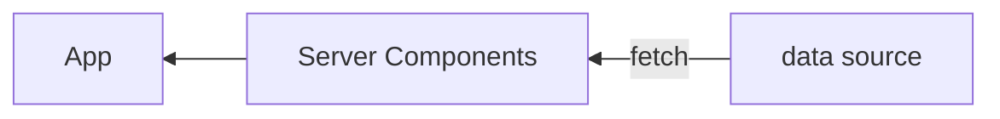
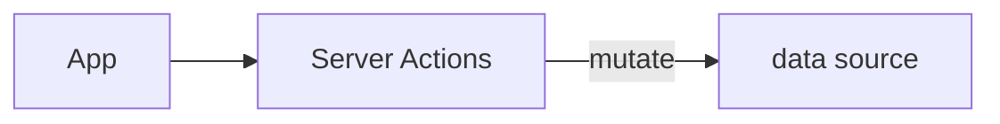

## はじめに

## React Hook Form について

[React Hook Form](https://react-hook-form.com) (以下 RHF と呼びます) は、フォームのバリデーションやエラーメッセージの表示などを簡潔に実装するためのライブラリです。`useState` など組み込みの hooks を使用してこれらの機能を素朴に実装することも可能ではありますが、そうした場合、複雑なフォームにおいてはコードが肥大化しメンテナビリティが低下することが通常です。こうしたフォームにまつわる複雑性を軽減してくれることから、RHF は React でフォームを実装する際に併用される人気のライブラリとしての地位を獲得してきました。また DX 面だけでなく、非制御コンポーネントを用いたマウント速度の向上や再描画の抑止など、パフォーマンス面についても重要視しています。

RHF は比較的有名なライブラリであるためその使い方について詳しく述べることはここではしませんが、以下の議論に必要な範囲で典型的なコードを確認しておきましょう。以下はメールアドレスとパスワードを送信するフォームのコード例です。メールアドレスの形式やパスワードの長さが invalid であればエラーを表示し、valid である場合のみ `onSubmit` ハンドラが実行されます。また、ここではバリデーション用のスキーマ定義のために [Valibot](https://valibot.dev/) を使っています。Valibot は tree-shakable かつ code-splittable な [Zod](https://zod.dev/) といった立ち位置のライブラリであり、その軽量さからスキーマを使用したクライアントサイドでのランタイムバリデーションに向いています。RHF では `@hookform/resolvers` というパッケージを通じて外部のバリデーション用ライブラリへのサポートを提供しており、Valibot のサポートも[今年の夏頃に追加](https://github.com/react-hook-form/resolvers/pull/602)されました:

```tsx:App.tsx
import { SubmitHandler, useForm } from "react-hook-form";
import { valibotResolver } from "@hookform/resolvers/valibot";
import { Output, email, minLength, object, string } from "valibot";

const LoginSchema = object({
  email: string([
    minLength(1, "メールアドレスを入力してください。"),
    email("メールアドレスの形式が正しくありません。"),
  ]),
  password: string([
    minLength(1, "パスワードを入力してください。"),
    minLength(8, "パスワードは8文字以上で入力してください。"),
  ]),
});

type LoginFormData = Output<typeof LoginSchema>;

export default function App() {
  const {
    register,
    handleSubmit,
    formState: { errors },
  } = useForm<LoginFormData>({
    resolver: valibotResolver(LoginSchema),
  });

  const onSubmit: SubmitHandler<LoginFormData> = (data) => console.log(data); // => { email, password }

  return (
    <form onSubmit={handleSubmit(onSubmit)}>
      <input {...register("email")} />
      <p>{errors.email?.message}</p>

      <input {...register("password")} />
      <p>{errors.password?.message}</p>

      <input type="submit" />
    </form>
  );
}
```

コードを見ればわかるように、フォームのスキーマを定義し、それをもとに `useForm` を呼び出し、然るべき場所に `register` や `handleSubmit` を配置するだけで、バリデーションやエラーメッセージの表示などの機能を実現できています。これが基本的な RHF の使い方です。RHF を使わず自前で同じことを実装する場合について考えてみると、RHF のありがたさについて理解できるはずです。

## Server Actions について
https://react.dev/reference/react/use-server
https://nextjs.org/docs/app/api-reference/functions/server-actions

Server Actions とは、クライアント側から呼び出される、サーバーサイドで実行可能な関数です。いわゆる RPC (Remote Procedure Call) の仕組みが React の世界に正式にもたらされたものであるといえます。[Server Components](https://github.com/reactjs/rfcs/blob/main/text/0188-server-components.md) が data fetching をサーバーサイドに移動するための仕組みと考えると、Server Actions は data mutation をサーバーサイドに移動するために導入された仕組みであり、両者は相補的な関係となっています。





Server Actions により、

- API レイヤー (Next.js の言葉では API Routes) を介さず直接サーバーサイドの関数をコンポーネントから実行できる
- ほげ

などの効用がもたらされることが期待されています^[Server Actions がもたらす恩恵については、Next.js 14 のアナウンスメント https://nextjs.org/blog/next-14#forms-and-mutations や、日本語であれば https://azukiazusa.dev/blog/why-use-server-actions/ がよくまとまっています]。

余談ですが、Server Actions に関するミームが X 上で少し前に流行っていましたね。震源は

https://twitter.com/adamrackis/status/1717607565260124613

だと思いますが、クライアントから直接 SQL クエリを実行するという見た目が多くの人々に衝撃を与えたようです。果てには Vercel CEO の Guillermo Rauch が悪ノリでミームジェネレータまで作ってしまい、なかなか楽しい展開でした:

https://twitter.com/rauchg/status/1718416777322123645

### サポート状況

10 月 5 日、React の Canary 版に Server Actions のサポートが[追加](https://github.com/facebook/react/blob/main/CHANGELOG-canary.md#october-5-2023-1830-canary-546178f91-20231005)されました。React の Canary 版は[フレームワークにとっての安定版である](https://react.dev/blog/2023/05/03/react-canaries)とみなされるため、この時点で各 React フレームワークが Server Actions を正式にサポートする前提が整ったといえます。そしてこれを受け、Next.js はバージョン 14 において Server Actions のサポート段階を [Stable へと引き上げ](https://nextjs.org/blog/next-14)ました。この記事を書いている段階で Server Actions をサポートしている Next.js 以外のフレームワークはないため、以下でコード例などを提示する際は Next.js プロジェクトであることを前提とすることとします。

### 実装方式
https://nextjs.org/docs/app/api-reference/functions/server-actions#convention

`'use server'` ディレクトリについて確認します。React の[ドキュメント](https://react.dev/reference/react/use-server)によると、

> `'use server'` marks server-side functions that can be called from client-side code.

### 実行方式
https://nextjs.org/docs/app/api-reference/functions/server-actions#invocation

### Progressive Enhancement
https://nextjs.org/docs/app/api-reference/functions/server-actions#progressive-enhancement

## Server Actions を React Hook Form と組み合わせる
https://github.com/react-hook-form/react-hook-form/issues/10391
https://github.com/orgs/react-hook-form/discussions/10757
https://twitter.com/dan_abramov/status/1725627709387120970: Custom Error は JSON を返し、Unexpected Error は Error Boundary でキャッチすればいいという話

## useFormState と useFormStatus、そして React Hook Form の Server Actions 対応について
https://react.dev/reference/react-dom/hooks/useFormState
https://react.dev/reference/react-dom/hooks/useFormStatus
https://github.com/react-hook-form/react-hook-form/pull/11061

## temp

https://github.com/vercel/next.js/tree/canary/examples/with-react-hook-form
https://nextjs.org/learn
https://github.com/vercel/next.js/tree/canary/examples/next-forms
https://zenn.dev/cybozu_frontend/articles/server-actions-error
https://zenn.dev/cybozu_frontend/articles/server-actions-and-revalidate
https://speakerdeck.com/mugi_uno/next-dot-js-app-router-deno-mpa-hurontoendoshua-xin